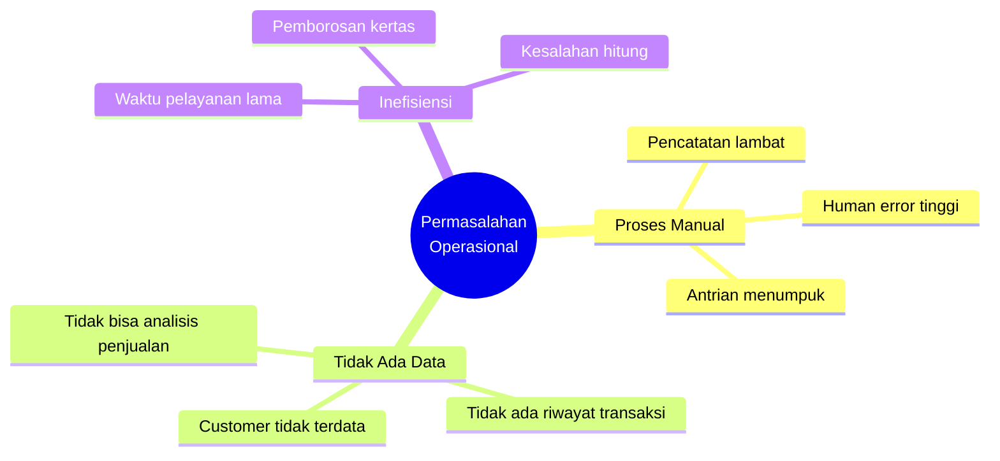
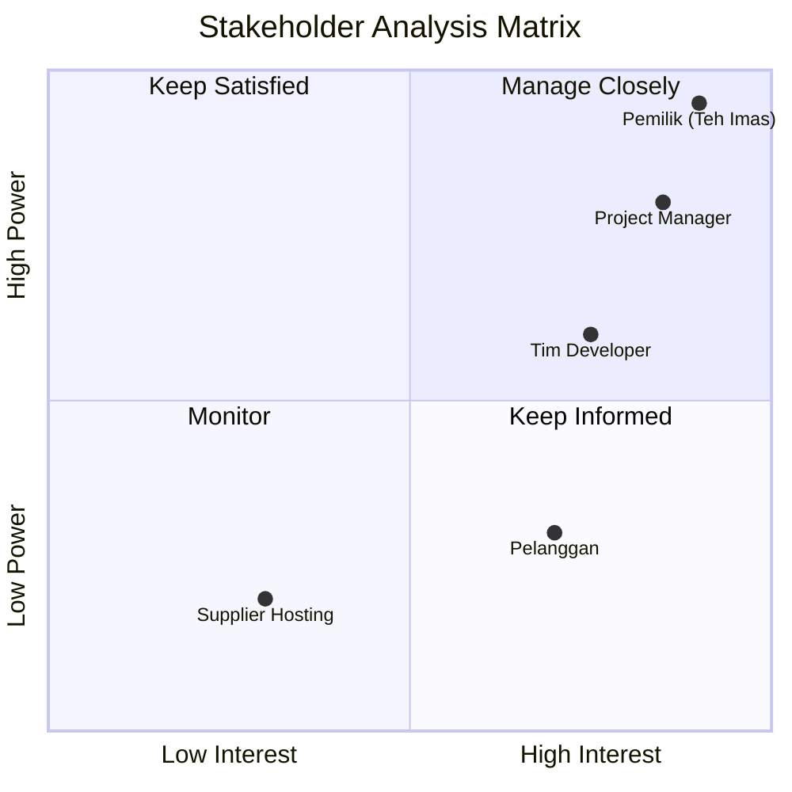
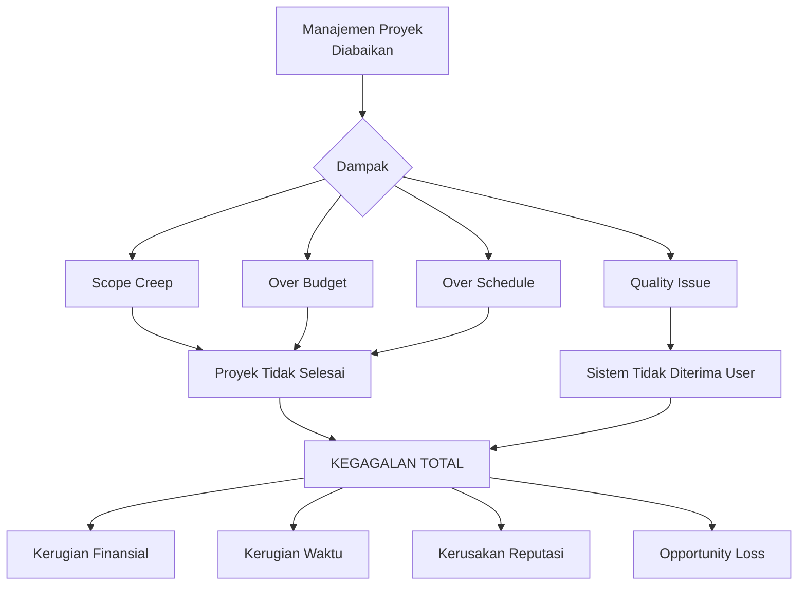

# PROJECT CHARTER

## Sistem Informasi POS-CRM "Seblak Teh Imas"

---

**Nama Proyek:** Pengembangan Sistem Informasi POS-CRM UMKM "Seblak Teh Imas"  
**Tanggal Dokumen:** 19 Januari 2026  
**Versi:** 1.0

---

## 1. Latar Belakang Masalah

### 1.1 Kondisi Saat Ini

Usaha kuliner "Seblak Teh Imas" adalah UMKM yang bergerak di bidang makanan dengan produk utama seblak dengan berbagai varian topping. Saat ini, operasional bisnis masih menggunakan metode konvensional dengan karakteristik sebagai berikut:

| Aspek                  | Kondisi Saat Ini               | Permasalahan                             |
| ---------------------- | ------------------------------ | ---------------------------------------- |
| **Pencatatan Pesanan** | Menggunakan kertas/nota manual | Risiko kesalahan tulis, nota hilang      |
| **Perhitungan Harga**  | Kalkulator manual              | Kesalahan hitung saat topping bervariasi |
| **Antrian Pesanan**    | Verbal/ingatan                 | Pesanan tertukar, waktu tunggu lama      |
| **Rekap Keuangan**     | Buku kas manual                | Akurasi rendah, rekap memakan waktu      |
| **Data Pelanggan**     | Tidak ada                      | Tidak dapat membangun loyalitas          |

### 1.2 Identifikasi Masalah Utama



### 1.3 Dampak Masalah

1. **Operasional:** Waktu pelayanan per pelanggan mencapai 5-7 menit (terlalu lama)
2. **Finansial:** Potensi kerugian akibat kesalahan hitung ±5-10% dari omzet harian
3. **Customer Experience:** Pelanggan tidak puas dengan antrian panjang
4. **Bisnis:** Tidak ada database untuk program loyalitas dan promosi

---

## 2. Tujuan Proyek

### 2.1 Tujuan Umum

Mengembangkan **Sistem Informasi Point of Sale dengan integrasi Customer Relationship Management (POS-CRM) berbasis Web** yang dapat mendigitalisasi seluruh proses operasional "Seblak Teh Imas" dari pemesanan hingga pelaporan.

### 2.2 Tujuan Khusus

| No  | Tujuan                              | Indikator Keberhasilan  | Target              |
| --- | ----------------------------------- | ----------------------- | ------------------- |
| 1   | Mendigitalisasi proses pemesanan    | Waktu input pesanan     | < 2 menit/transaksi |
| 2   | Menghilangkan kesalahan perhitungan | Akurasi harga           | 100%                |
| 3   | Mempercepat proses antrian          | Throughput pelanggan    | +50%                |
| 4   | Membangun database pelanggan        | Jumlah member terdaftar | > 100 dalam 3 bulan |
| 5   | Menyediakan laporan real-time       | Ketersediaan dashboard  | 24/7                |

### 2.3 SMART Goals

- **S**pecific: Sistem POS-CRM untuk UMKM kuliner Seblak Teh Imas
- **M**easurable: Menurunkan waktu pelayanan 50%, akurasi perhitungan 100%
- **A**chievable: Teknologi web modern, tim 3 orang, 8-10 minggu
- **R**elevant: Mendukung digitalisasi UMKM era industri 4.0
- **T**ime-bound: Selesai dalam 10 minggu kerja

---

## 3. Stakeholder Utama & Perannya

### 3.1 Matriks Stakeholder



### 3.2 Daftar Stakeholder

| Stakeholder                          | Kategori  | Peran               | Kepentingan | Pengaruh |
| ------------------------------------ | --------- | ------------------- | ----------- | -------- |
| **Teh Imas (Pemilik)**               | Internal  | Project Sponsor     | Tinggi      | Tinggi   |
| **M. Z. Haikal Hamdani**             | Internal  | Project Manager     | Tinggi      | Tinggi   |
| **Lutpandea Putra S.**               | Internal  | Project Planner     | Tinggi      | Sedang   |
| **Etheldreda Maria H.P.W.**          | Internal  | Cost & Risk Analyst | Tinggi      | Sedang   |
| **Pelanggan Seblak**                 | Eksternal | End User            | Tinggi      | Rendah   |
| **Provider Cloud (Vercel/Supabase)** | Eksternal | Vendor              | Rendah      | Rendah   |

### 3.3 Tanggung Jawab Stakeholder

#### A. Project Sponsor (Pemilik - Teh Imas)

- Memberikan persetujuan atas scope dan budget proyek
- Menyediakan informasi kebutuhan bisnis
- Melakukan User Acceptance Testing (UAT)
- Memberikan keputusan final atas perubahan scope

#### B. Project Manager (M. Z. Haikal Hamdani)

- Menyusun Project Charter dan scope proyek
- Koordinasi tim dan stakeholder
- Monitoring progress dan milestone
- Manajemen risiko dan issue resolution

#### C. Project Planner (Lutpandea Putra S.)

- Menyusun Work Breakdown Structure (WBS)
- Membuat Network Diagram dan analisis jalur kritis
- Mengembangkan Gantt Chart dan timeline
- Tracking aktivitas dan dependensi

#### D. Cost & Risk Analyst (Etheldreda Maria H.P.W.)

- Melakukan estimasi biaya proyek
- Analisis Cost-Benefit (CBA)
- Identifikasi dan analisis risiko
- Menyusun strategi mitigasi risiko

---

## 4. Ruang Lingkup Proyek

### 4.1 In-Scope (Termasuk dalam Proyek)

#### Modul 1: Point of Sale (POS)

- [ ] Sistem pemesanan digital dengan kustomisasi (level pedas, topping, dll)
- [ ] Keranjang belanja dan checkout
- [ ] Generate struk digital
- [ ] Manajemen antrian otomatis

#### Modul 2: Customer Relationship Management (CRM)

- [ ] Registrasi dan login member
- [ ] Sistem membership tier (Bronze/Silver/Gold)
- [ ] Riwayat pesanan pelanggan
- [ ] Sistem feedback dan rating

#### Modul 3: Dashboard Admin

- [ ] Dashboard real-time (order masuk, status)
- [ ] Manajemen pesanan (update status)
- [ ] Laporan pendapatan harian/bulanan
- [ ] Manajemen data pelanggan

#### Modul 4: Infrastruktur

- [ ] Web Application dengan Progressive Web App (PWA)
- [ ] Database PostgreSQL (cloud)
- [ ] Deployment ke cloud platform

### 4.2 Out-of-Scope (Tidak Termasuk)

| Item                                        | Alasan Tidak Termasuk                          |
| ------------------------------------------- | ---------------------------------------------- |
| Integrasi payment gateway (OVO, GoPay, dll) | Kompleksitas tinggi, butuh sertifikasi PCI-DSS |
| Native mobile app (Android/iOS)             | PWA sudah mencukupi kebutuhan                  |
| Modul inventory lengkap                     | Fokus pada POS dan CRM dulu                    |
| Multi-outlet management                     | Bisnis masih single outlet                     |
| Integrasi akunting (Jurnal, Accurate)       | Tahap pengembangan lanjutan                    |

### 4.3 Batasan Proyek

1. **Waktu:** Maksimal 10 minggu kerja
2. **Budget:** Sesuai dengan yang disepakati dalam dokumen perencanaan
3. **Teknologi:** Stack berbasis JavaScript/TypeScript (Next.js, PostgreSQL)
4. **Tim:** 3 orang dengan pembagian peran yang jelas

### 4.4 Asumsi Proyek

1. Pemilik bisnis tersedia untuk requirement gathering dan UAT
2. Akses internet stabil tersedia di lokasi usaha
3. Tersedia perangkat (tablet/smartphone) untuk operasional
4. Tidak ada perubahan major pada proses bisnis selama pengembangan

---

## 5. Etika & Profesionalisme Tim Proyek

### 5.1 Kode Etik Tim

| Prinsip             | Deskripsi                          | Implementasi                               |
| ------------------- | ---------------------------------- | ------------------------------------------ |
| **Integritas**      | Jujur dalam pelaporan progress     | Daily standup, transparan jika ada blocker |
| **Tanggung Jawab**  | Bertanggung jawab atas deliverable | Setiap task ada PIC yang jelas             |
| **Kerahasiaan**     | Menjaga data bisnis klien          | NDA, tidak share data tanpa izin           |
| **Profesionalisme** | Bekerja sesuai standar industri    | Code review, dokumentasi lengkap           |
| **Kolaborasi**      | Bekerja sama sebagai tim           | Regular meeting, komunikasi aktif          |

### 5.2 Etika Pengembangan Sistem

1. **Privacy by Design:** Data pelanggan hanya digunakan untuk keperluan sistem
2. **Security First:** Password di-hash, data sensitif dienkripsi
3. **Accessibility:** Sistem dapat diakses oleh berbagai kalangan
4. **Sustainability:** Kode dapat di-maintain untuk jangka panjang

### 5.3 Komitmen Kualitas

```
┌─────────────────────────────────────────────────────────────┐
│                    QUALITY COMMITMENT                       │
├─────────────────────────────────────────────────────────────┤
│ ✓ Clean Code        : Kode terstruktur dan readable        │
│ ✓ Testing           : Unit test minimal 60% coverage       │
│ ✓ Documentation     : Dokumentasi teknis dan user guide    │
│ ✓ Responsive Design : Optimal di mobile dan desktop        │
│ ✓ Performance       : Load time < 3 detik                  │
└─────────────────────────────────────────────────────────────┘
```

---

## 6. Konsekuensi Kegagalan Proyek

> **CRITICAL POINT:** Bagian ini menjelaskan dampak negatif yang terjadi jika manajemen proyek diabaikan atau proyek gagal diselesaikan.

### 6.1 Skenario Kegagalan



### 6.2 Dampak Kegagalan

#### A. Dampak Operasional

| Jika Gagal...          | Maka...                   | Estimasi Kerugian     |
| ---------------------- | ------------------------- | --------------------- |
| Sistem tidak jadi      | Tetap manual              | Inefisiensi berlanjut |
| Sistem tidak reliable  | Downtime saat operasional | Kehilangan pelanggan  |
| Sistem sulit digunakan | User menolak adopsi       | Investasi sia-sia     |

#### B. Dampak Finansial

```
Investment yang Hilang:
├── Biaya pengembangan      : Rp 15.000.000 - 25.000.000
├── Opportunity cost        : Rp 5.000.000 (waktu tim)
├── Biaya infrastruktur     : Rp 2.000.000
└── TOTAL POTENSIAL LOSS    : Rp 22.000.000 - 32.000.000
```

#### C. Dampak Jangka Panjang

1. **Trust Erosion:** Kehilangan kepercayaan stakeholder untuk proyek selanjutnya
2. **Competitive Disadvantage:** Kompetitor yang sudah digital akan unggul
3. **Team Morale:** Demotivasi tim karena proyek gagal
4. **Learning Loss:** Tidak ada pembelajaran dari proyek yang seharusnya bisa dipetik

### 6.3 Analisis Penyebab Kegagalan Umum

| Penyebab                     | Probabilitas | Dampak | Pencegahan                            |
| ---------------------------- | ------------ | ------ | ------------------------------------- |
| Poor requirement gathering   | 40%          | Tinggi | Validasi requirement dengan prototype |
| Scope creep tidak terkontrol | 50%          | Tinggi | Change control board, scope baseline  |
| Komunikasi buruk             | 35%          | Sedang | Regular meeting, dokumentasi jelas    |
| Technical debt               | 45%          | Sedang | Code review, refactoring rutin        |
| Resource constraint          | 30%          | Sedang | Resource planning, backup plan        |

### 6.4 Kesimpulan Pentingnya Manajemen Proyek

> [!CAUTION]
> **Tanpa manajemen proyek yang baik:**
>
> - 70% proyek SI gagal mencapai tujuan awal
> - 50% proyek melebihi budget
> - 60% proyek melebihi jadwal
>
> _Sumber: Standish Group CHAOS Report_

Oleh karena itu, proyek ini menerapkan:

1. ✅ Project Charter yang jelas
2. ✅ WBS dan Network Diagram terstruktur
3. ✅ Monitoring progress dengan Gantt Chart
4. ✅ Risk Management proaktif
5. ✅ Quality assurance di setiap fase

---

## 7. Persetujuan & Tanda Tangan

| Nama                    | Jabatan             | Tanda Tangan   | Tanggal      |
| ----------------------- | ------------------- | -------------- | ------------ |
| Teh Imas                | Project Sponsor     | ******\_****** | **_/_**/2026 |
| M. Z. Haikal Hamdani    | Project Manager     | ******\_****** | **_/_**/2026 |
| Lutpandea Putra S.      | Project Planner     | ******\_****** | **_/_**/2026 |
| Etheldreda Maria H.P.W. | Cost & Risk Analyst | ******\_****** | **_/_**/2026 |

---

_Dokumen ini adalah bagian dari Final Project mata kuliah Manajemen Proyek Sistem Informasi (MPSI)_

**Disiapkan oleh:** Tim Kelompok MPSI  
**Tanggal:** 19 Januari 2026
