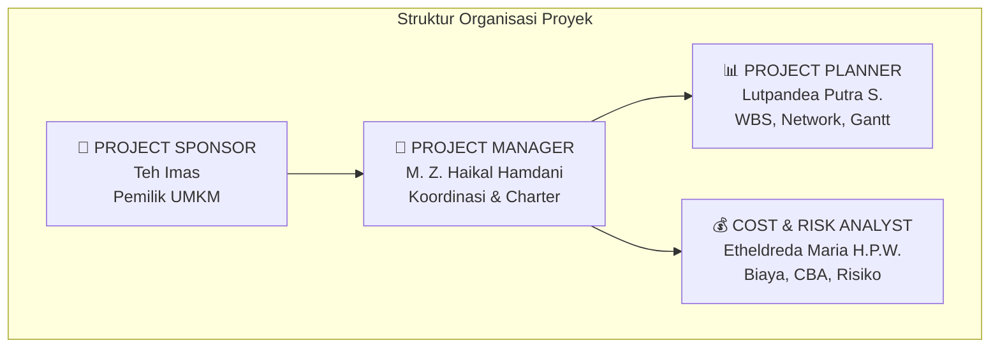
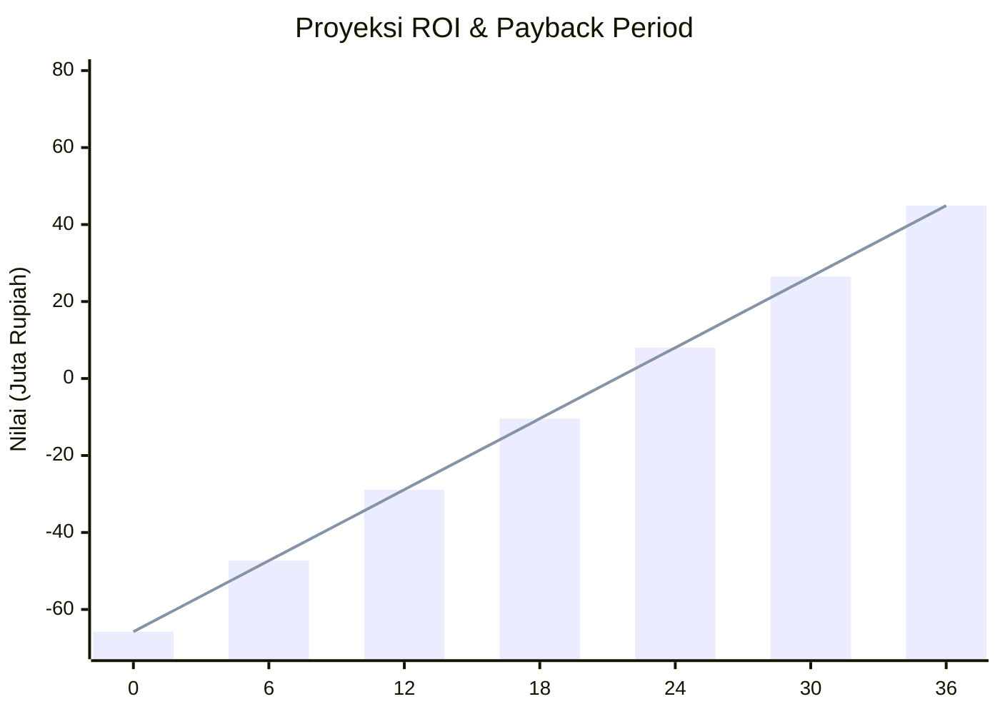
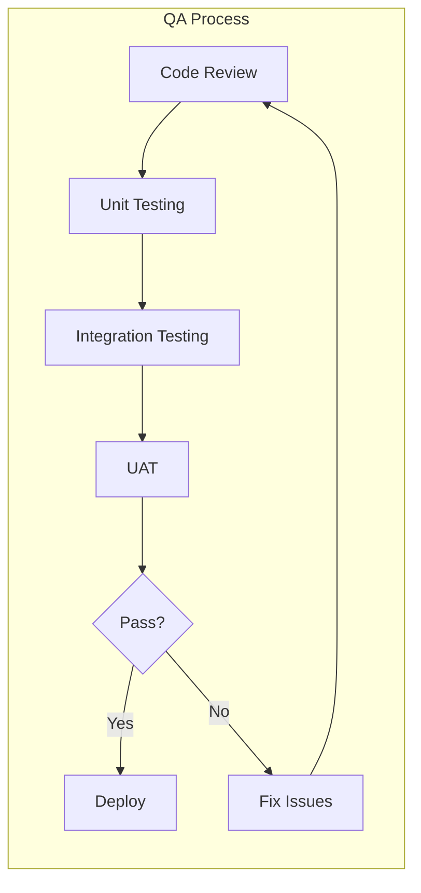

# PERENCANAAN PROYEK

## Sistem Informasi POS-CRM "Seblak Teh Imas"

---

**Nama Proyek:** Pengembangan Sistem Informasi POS-CRM UMKM "Seblak Teh Imas"  
**Tanggal Dokumen:** 19 Januari 2026  
**Versi:** 1.0  
**CLO:** CLO2 - Perencanaan Proyek

---

## 1. Struktur Organisasi Proyek

### 1.1 Diagram Organisasi



### 1.2 Deskripsi Peran & Tanggung Jawab (RACI Matrix)

| Aktivitas                | Project Sponsor | Project Manager | Project Planner | Cost & Risk Analyst |
| ------------------------ | :-------------: | :-------------: | :-------------: | :-----------------: |
| Approval Project Charter |      **A**      |        R        |        C        |          C          |
| Menyusun WBS             |        I        |        A        |      **R**      |          C          |
| Network Diagram          |        I        |        A        |      **R**      |          C          |
| Gantt Chart              |        I        |        A        |      **R**      |          C          |
| Estimasi Biaya           |        A        |        C        |        C        |        **R**        |
| Analisis CBA             |        A        |        C        |        I        |        **R**        |
| Manajemen Risiko         |        I        |        A        |        C        |        **R**        |
| Monitoring Progress      |        I        |      **R**      |        C        |          C          |
| UAT & Acceptance         |      **R**      |        A        |        C        |          C          |

> **Keterangan:** R = Responsible, A = Accountable, C = Consulted, I = Informed

### 1.3 Detail Tugas Per Anggota

#### A. Project Manager - M. Z. Haikal Hamdani

| Fase       | Tugas                    | Deliverable          |
| ---------- | ------------------------ | -------------------- |
| Inisiasi   | Menyusun Project Charter | Document signed      |
| Inisiasi   | Identifikasi stakeholder | Stakeholder register |
| Semua Fase | Koordinasi tim           | Meeting minutes      |
| Semua Fase | Monitoring progress      | Status report        |
| Closing    | Evaluasi proyek          | Lesson learned       |

#### B. Project Planner - Lutpandea Putra Sutriyana

| Fase        | Tugas                    | Deliverable                       |
| ----------- | ------------------------ | --------------------------------- |
| Perencanaan | Menyusun WBS             | WBS document                      |
| Perencanaan | Membuat daftar aktivitas | Activity list                     |
| Perencanaan | Network Diagram          | Network diagram                   |
| Perencanaan | Analisis jalur kritis    | Critical path analysis            |
| Perencanaan | Gantt Chart              | Gantt chart (manual & MS Project) |
| Eksekusi    | Tracking progress        | Updated schedule                  |

#### C. Cost & Risk Analyst - Etheldreda Maria Hervem Pita Wea

| Fase        | Tugas                 | Deliverable          |
| ----------- | --------------------- | -------------------- |
| Perencanaan | Estimasi biaya        | Cost estimate        |
| Perencanaan | Analisis CBA          | CBA document         |
| Perencanaan | Identifikasi risiko   | Risk register        |
| Perencanaan | Analisis risiko       | Risk matrix          |
| Semua Fase  | Mitigasi risiko       | Mitigation plan      |
| Closing     | Evaluasi biaya aktual | Cost variance report |

---

## 2. Estimasi Sumber Daya

### 2.1 Sumber Daya Manusia (SDM)

| No  | Peran                | Jumlah | Jam Kerja/Minggu | Total Minggu |  Total Jam  |
| --- | -------------------- | :----: | :--------------: | :----------: | :---------: |
| 1   | Project Manager      |   1    |        10        |      10      |     100     |
| 2   | Project Planner      |   1    |        15        |      10      |     150     |
| 3   | Cost & Risk Analyst  |   1    |        12        |      10      |     120     |
| 4   | UI/UX Designer\*     |   1    |        20        |      3       |     60      |
| 5   | Frontend Developer\* |   1    |        35        |      6       |     210     |
| 6   | Backend Developer\*  |   1    |        35        |      6       |     210     |
| 7   | Quality Assurance\*  |   1    |        15        |      3       |     45      |
|     | **TOTAL**            | **7**  |                  |              | **895 jam** |

> \*Catatan: Untuk simulasi proyek, peran teknis dapat diasumsikan dilakukan oleh tim pengembang eksternal atau anggota yang multitasking.

### 2.2 Sumber Daya Non-SDM (Hardware & Software)

#### A. Hardware

| Item               | Spesifikasi      | Qty | Kepemilikan | Keterangan        |
| ------------------ | ---------------- | :-: | ----------- | ----------------- |
| Laptop Development | Min. i5, 8GB RAM |  3  | Sudah ada   | Milik tim         |
| Tablet Kasir       | Android 10+, 10" |  1  | Perlu beli  | Untuk operasional |
| Smartphone Testing | Android/iOS      |  2  | Sudah ada   | Milik tim         |

#### B. Software & Services

| Item            | Jenis           | Biaya/Bulan | Durasi |      Total |
| --------------- | --------------- | ----------: | :----: | ---------: |
| VS Code         | IDE             |      Gratis |   -    |       Rp 0 |
| Figma           | Design Tool     |      Gratis |   -    |       Rp 0 |
| Vercel Hobby    | Hosting         |      Gratis |   -    |       Rp 0 |
| Supabase Free   | Database        |      Gratis |   -    |       Rp 0 |
| GitHub          | Version Control |      Gratis |   -    |       Rp 0 |
| Domain .com     | Domain          |  Rp 150.000 | 12 bln | Rp 150.000 |
| Microsoft 365\* | Tools           |  Rp 100.000 | 3 bln  | Rp 300.000 |

> \*Opsional, bisa menggunakan alternatif gratis seperti Google Workspace

### 2.3 Resource Loading Chart

```
Minggu    : W1  W2  W3  W4  W5  W6  W7  W8  W9  W10
═══════════════════════════════════════════════════════════
PM        : ███ ██░ ██░ ██░ ██░ ██░ ██░ ██░ ██░ ███
Planner   : ███ ███ ███ ██░ ██░ ██░ ██░ ██░ ███ ███
Analyst   : ██░ ███ ███ ██░ ██░ ██░ ██░ ██░ ██░ ███
Designer  : ░░░ ███ ███ ███ ░░░ ░░░ ░░░ ░░░ ░░░ ░░░
Frontend  : ░░░ ░░░ ██░ ███ ███ ███ ███ ███ ██░ ░░░
Backend   : ░░░ ░░░ ██░ ███ ███ ███ ███ ███ ██░ ░░░
QA        : ░░░ ░░░ ░░░ ░░░ ░░░ ░░░ ░░░ ███ ███ ███
═══════════════════════════════════════════════════════════
Legenda   : ███ = Full Load  ██░ = Partial  ░░░ = Tidak aktif
```

---

## 3. Analisis Biaya & Manfaat (Cost-Benefit Analysis)

### 3.1 Estimasi Biaya Pengembangan

#### A. Biaya Langsung (Direct Cost)

| Kategori           | Item             |   Qty   | Harga Satuan |             Total |
| ------------------ | ---------------- | :-----: | -----------: | ----------------: |
| **SDM**            | Project Manager  | 100 jam |    Rp 50.000 |      Rp 5.000.000 |
|                    | Project Planner  | 150 jam |    Rp 40.000 |      Rp 6.000.000 |
|                    | Cost Analyst     | 120 jam |    Rp 40.000 |      Rp 4.800.000 |
|                    | UI/UX Designer   | 60 jam  |    Rp 75.000 |      Rp 4.500.000 |
|                    | Frontend Dev     | 210 jam |    Rp 80.000 |     Rp 16.800.000 |
|                    | Backend Dev      | 210 jam |    Rp 80.000 |     Rp 16.800.000 |
|                    | QA Tester        | 45 jam  |    Rp 50.000 |      Rp 2.250.000 |
| **Subtotal SDM**   |                  |         |              | **Rp 56.150.000** |
|                    |                  |         |              |                   |
| **Infrastruktur**  | Domain (1 tahun) |    1    |   Rp 150.000 |        Rp 150.000 |
|                    | Cloud Hosting\*  | 12 bln  |         Rp 0 |              Rp 0 |
|                    | Database\*       | 12 bln  |         Rp 0 |              Rp 0 |
| **Subtotal Infra** |                  |         |              |    **Rp 150.000** |
|                    |                  |         |              |                   |
| **Hardware**       | Tablet Kasir     |    1    | Rp 2.500.000 |      Rp 2.500.000 |
| **Subtotal HW**    |                  |         |              |  **Rp 2.500.000** |

> \*Menggunakan tier gratis dari Vercel dan Supabase

#### B. Biaya Tidak Langsung (Indirect Cost)

| Item                         | Estimasi         |
| ---------------------------- | ---------------- |
| Overhead (listrik, internet) | Rp 500.000       |
| Komunikasi & meeting         | Rp 300.000       |
| Dokumentasi & cetak          | Rp 200.000       |
| Contingency (10%)            | Rp 5.980.000     |
| **Subtotal Indirect**        | **Rp 6.980.000** |

#### C. Total Biaya Proyek

| Komponen                     |            Jumlah |
| ---------------------------- | ----------------: |
| Biaya Langsung SDM           |     Rp 56.150.000 |
| Biaya Langsung Infrastruktur |        Rp 150.000 |
| Biaya Langsung Hardware      |      Rp 2.500.000 |
| Biaya Tidak Langsung         |      Rp 6.980.000 |
| **TOTAL BIAYA PROYEK**       | **Rp 65.780.000** |

### 3.2 Estimasi Manfaat (Benefits)

#### A. Manfaat Tangible (Terukur)

| Manfaat          | Kondisi Lama   | Kondisi Baru  |   Penghematan/Bulan |
| ---------------- | -------------- | ------------- | ------------------: |
| Waktu pelayanan  | 7 menit/order  | 3 menit/order |     57% lebih cepat |
| Kesalahan hitung | 5% transaksi   | 0% transaksi  |  Rp 500.000/bulan\* |
| Kertas nota      | 500 lembar/bln | 0 lembar      |     Rp 75.000/bulan |
| Rekap keuangan   | 2 jam/hari     | 5 menit/hari  | Waktu 1.75 jam/hari |
| Throughput       | 50 order/hari  | 80 order/hari |      +60% kapasitas |

> \*Asumsi rata-rata kesalahan Rp 10.000 × 50 transaksi dengan error

**Total Penghematan:** Rp 575.000/bulan atau **Rp 6.900.000/tahun**

#### B. Manfaat Intangible (Tidak Terukur)

| Manfaat              | Deskripsi                                  |
| -------------------- | ------------------------------------------ |
| Profesionalisme      | Citra usaha lebih modern                   |
| Customer Experience  | Pelayanan lebih cepat dan akurat           |
| Data-Driven Decision | Analisis penjualan berbasis data           |
| Customer Loyalty     | Database pelanggan untuk program loyalitas |
| Scalability          | Siap untuk ekspansi bisnis                 |

### 3.3 Perhitungan ROI (Return on Investment)

```
ROI = (Total Manfaat - Total Biaya) / Total Biaya × 100%

Tahun 1:
- Total Biaya       = Rp 65.780.000
- Manfaat Langsung  = Rp 6.900.000
- Revenue Increase* = Rp 36.000.000 (asumsi +30 order/hari × Rp 10.000 × 30 hari × 12 bln)
- Total Manfaat     = Rp 42.900.000

ROI Tahun 1 = (42.900.000 - 65.780.000) / 65.780.000 × 100%
            = -34.8% (belum balik modal)

Tahun 2:
- Biaya Operasional = Rp 2.000.000 (maintenance)
- Total Manfaat     = Rp 42.900.000

ROI Tahun 2 = (42.900.000 - 2.000.000) / 65.780.000 × 100%
            = +62.2%

Break-Even Point = ~18.4 bulan
```

### 3.4 Payback Period



**Kesimpulan CBA:**

- Total Investasi: Rp 65.780.000
- Break-Even Point: ~18.4 bulan (1.5 tahun)
- ROI Tahun ke-3: +168%
- **Recommendation: LAYAK DILANJUTKAN** ✅

---

## 4. Perencanaan Kualitas Proyek

### 4.1 Standar Kualitas

| Aspek               | Standar         | Metrik          | Target     |
| ------------------- | --------------- | --------------- | ---------- |
| **Reliability**     | Uptime sistem   | Availability    | 99%        |
| **Performance**     | Response time   | Page load       | < 3 detik  |
| **Usability**       | User experience | SUS Score       | > 70       |
| **Security**        | Data protection | Vulnerabilities | 0 critical |
| **Maintainability** | Code quality    | Tech debt       | < 5%       |

### 4.2 Quality Assurance Activities



### 4.3 Acceptance Criteria

#### Modul POS

- [ ] User dapat membuat pesanan dalam < 2 menit
- [ ] Perhitungan total harga 100% akurat
- [ ] Struk digital dapat di-generate dan di-download
- [ ] Status pesanan terupdate real-time

#### Modul CRM

- [ ] Member dapat login dengan nama + nomor HP
- [ ] Sistem membership tier berfungsi otomatis
- [ ] Riwayat pesanan tersimpan dan dapat diakses
- [ ] Feedback dapat diberikan dan tersimpan

#### Dashboard Admin

- [ ] Dashboard menampilkan data real-time
- [ ] Laporan dapat di-export
- [ ] Manajemen pesanan berfungsi lengkap

### 4.4 Quality Control Checklist

| Fase        | Aktivitas QC          | PIC       | Status |
| ----------- | --------------------- | --------- | ------ |
| Design      | Review UI mockup      | PM        | ☐      |
| Development | Code review setiap PR | Developer | ☐      |
| Testing     | Execute test cases    | QA        | ☐      |
| UAT         | User testing          | Sponsor   | ☐      |
| Deployment  | Smoke test production | QA        | ☐      |

---

## 5. Perbandingan Skenario Anggaran

> **CRITICAL POINT:** Membandingkan 2 skenario proyek dengan anggaran berbeda dan menentukan mana yang lebih rasional.

### 5.1 Skenario A: Anggaran Terbatas (Rp 8-15 Juta)

#### Karakteristik

| Aspek        | Detail                    |
| ------------ | ------------------------- |
| **Budget**   | Rp 8.000.000 - 15.000.000 |
| **Tim**      | 1-2 orang (generalist)    |
| **Timeline** | 12-16 minggu              |
| **Scope**    | Basic POS only            |

#### Breakdown Biaya

| Item                  |           Alokasi |
| --------------------- | ----------------: |
| Developer (freelance) |     Rp 10.000.000 |
| Domain & Hosting      |        Rp 500.000 |
| Tablet                |      Rp 2.500.000 |
| Buffer                |      Rp 2.000.000 |
| **TOTAL**             | **Rp 15.000.000** |

#### Fitur yang Tersedia

| Fitur                   | Status    |
| ----------------------- | --------- |
| ✅ Order digital        | Ada       |
| ✅ Perhitungan otomatis | Ada       |
| ✅ Struk digital        | Ada       |
| ⚠️ Dashboard admin      | Minimal   |
| ❌ Sistem CRM           | Tidak ada |
| ❌ Membership           | Tidak ada |
| ❌ Laporan analytics    | Tidak ada |

#### Kelebihan & Kekurangan

| Kelebihan                             | Kekurangan                        |
| ------------------------------------- | --------------------------------- |
| ✓ Biaya rendah                        | ✗ Fitur sangat terbatas           |
| ✓ Cepat selesai (untuk scope minimal) | ✗ Tidak ada competitive advantage |
| ✓ Risiko finansial kecil              | ✗ Sulit scale up                  |
|                                       | ✗ Tidak ada data pelanggan        |

---

### 5.2 Skenario B: Anggaran Ideal (Rp 50-70 Juta)

#### Karakteristik

| Aspek        | Detail                     |
| ------------ | -------------------------- |
| **Budget**   | Rp 50.000.000 - 70.000.000 |
| **Tim**      | 4-5 orang (spesialist)     |
| **Timeline** | 10-12 minggu               |
| **Scope**    | Full POS + CRM             |

#### Breakdown Biaya

| Item               |           Alokasi |
| ------------------ | ----------------: |
| Project Manager    |      Rp 5.000.000 |
| Project Planner    |      Rp 6.000.000 |
| Cost Analyst       |      Rp 4.800.000 |
| UI/UX Designer     |      Rp 4.500.000 |
| Frontend Developer |     Rp 16.800.000 |
| Backend Developer  |     Rp 16.800.000 |
| QA Tester          |      Rp 2.250.000 |
| Infrastruktur      |      Rp 2.650.000 |
| Buffer (10%)       |      Rp 5.980.000 |
| **TOTAL**          | **Rp 65.780.000** |

#### Fitur yang Tersedia

| Fitur                        | Status |
| ---------------------------- | ------ |
| ✅ Order digital lengkap     | Ada    |
| ✅ Kustomisasi pesanan       | Ada    |
| ✅ Dashboard admin real-time | Ada    |
| ✅ Sistem CRM lengkap        | Ada    |
| ✅ Membership tier           | Ada    |
| ✅ Laporan & analytics       | Ada    |
| ✅ PWA (installable)         | Ada    |
| ✅ Feedback system           | Ada    |

#### Kelebihan & Kekurangan

| Kelebihan                        | Kekurangan                          |
| -------------------------------- | ----------------------------------- |
| ✓ Fitur lengkap                  | ✗ Biaya tinggi                      |
| ✓ Competitive advantage          | ✗ Risiko finansial lebih besar      |
| ✓ Scalable untuk ekspansi        | ✗ Butuh tim lebih besar             |
| ✓ Data pelanggan untuk marketing | ✗ ROI baru terasa setelah 1.5 tahun |
| ✓ Profesional & modern           |                                     |

---

### 5.3 Perbandingan Langsung

```mermaid
xychart-beta
    title "Perbandingan Skenario Anggaran"
    x-axis ["Budget (Juta)", "Fitur (%)", "Timeline (Minggu)", "ROI Th.3 (%)"]
    y-axis 0 --> 200
    bar [15, 40, 14, 50]
    bar [65, 100, 10, 168]
```



| Kriteria         | Skenario A (Terbatas) | Skenario B (Ideal) | Winner |
| ---------------- | :-------------------: | :----------------: | :----: |
| Budget           |      Rp 15 juta       |     Rp 65 juta     |   A    |
| Fitur            |          40%          |        100%        | **B**  |
| Timeline         |       14 minggu       |     10 minggu      | **B**  |
| ROI Year 3       |         +50%          |       +168%        | **B**  |
| Risk             |        Rendah         |       Sedang       |   A    |
| Scalability      |        Rendah         |       Tinggi       | **B**  |
| Customer Loyalty |       Tidak ada       |        Ada         | **B**  |

### 5.4 Rekomendasi: Mana yang Lebih Rasional?

> [!IMPORTANT]
> **REKOMENDASI: SKENARIO B (ANGGARAN IDEAL)**

#### Justifikasi Logis:

1. **ROI Lebih Tinggi (168% vs 50%)**
   - Meskipun investasi lebih besar, return yang didapat jauh lebih signifikan
   - Payback period masih reasonable (18 bulan)

2. **Competitive Advantage**
   - CRM memberikan data pelanggan yang tidak dimiliki kompetitor
   - Sistem membership menciptakan customer lock-in

3. **Opportunity Cost**
   - Skenario A = kehilangan potensi pendapatan dari customer loyalty
   - Data menunjukkan repeat customer menghasilkan 40% lebih banyak revenue

4. **Long-term Value**
   - Sistem yang scalable untuk ekspansi bisnis
   - Tidak perlu bangun ulang jika ingin tambah fitur

5. **Total Cost of Ownership (TCO)**

   ```
   Skenario A + upgrade CRM di tahun ke-2:
   = Rp 15.000.000 + Rp 40.000.000 = Rp 55.000.000
   + Biaya integrasi/migrasi       = Rp 10.000.000
   + Technical debt                = Rp 5.000.000
   = TOTAL: Rp 70.000.000

   Skenario B dari awal:
   = Rp 65.780.000

   LEBIH HEMAT: Rp 4.220.000
   ```

#### Kondisi Khusus Memilih Skenario A:

Skenario A hanya rasional jika:

- Budget benar-benar tidak tersedia dan tidak bisa mendapat funding
- Bisnis masih dalam tahap validasi (belum proven)
- Timeline sangat mendesak (< 4 minggu)
- Tidak ada rencana ekspansi dalam 3 tahun ke depan

---

## 6. Kesimpulan Perencanaan

| Aspek             | Keputusan                         |
| ----------------- | --------------------------------- |
| Struktur Tim      | 3 anggota inti + support external |
| Total SDM         | 7 orang dengan berbagai peran     |
| Total Budget      | Rp 65.780.000 (Skenario Ideal)    |
| ROI Target        | 168% di tahun ke-3                |
| Quality Standard  | 99% uptime, < 3 detik load time   |
| Skenario Terpilih | **Skenario B - Anggaran Ideal**   |

---

_Dokumen ini adalah bagian dari Final Project mata kuliah Manajemen Proyek Sistem Informasi (MPSI)_

**Disiapkan oleh:** Etheldreda Maria Hervem Pita Wea (Cost & Risk Analyst)  
**Direview oleh:** M. Z. Haikal Hamdani (Project Manager)  
**Tanggal:** 19 Januari 2026
