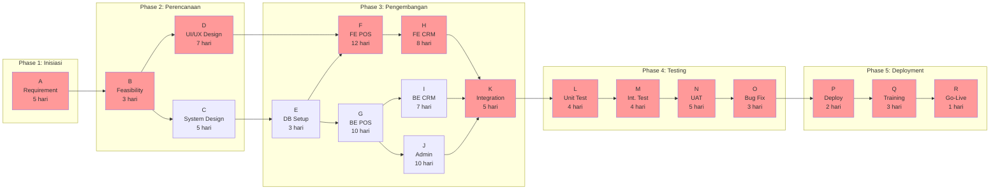
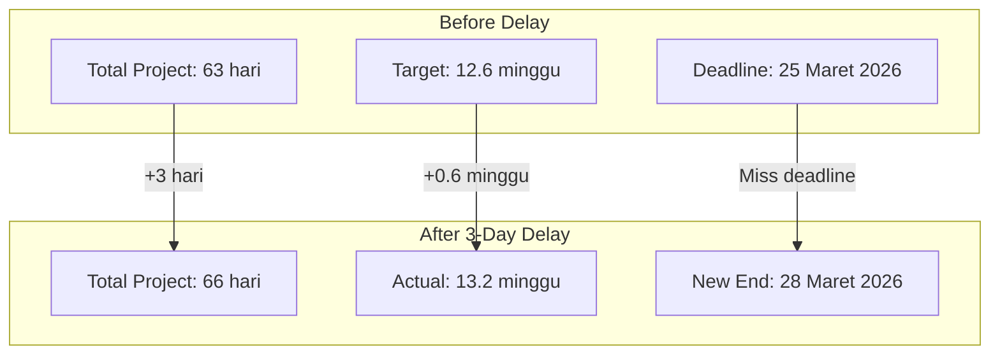
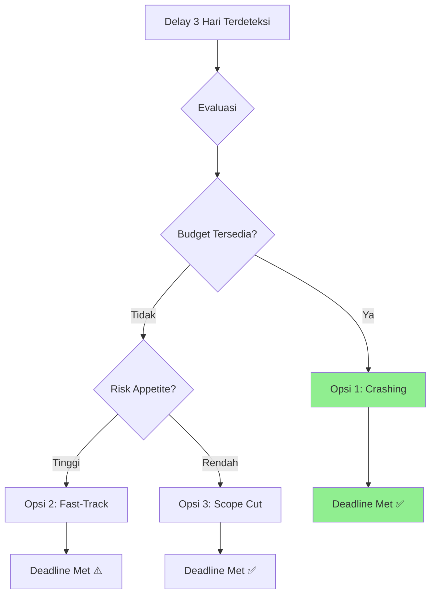

# NETWORK DIAGRAM & JALUR KRITIS

## Sistem Informasi POS-CRM "Seblak Teh Imas"

---

**Nama Proyek:** Pengembangan Sistem Informasi POS-CRM UMKM "Seblak Teh Imas"  
**Tanggal Dokumen:** 19 Januari 2026  
**Versi:** 1.0  
**CLO:** CLO3 - Network Diagram & Jalur Kritis

---

## 1. Daftar Aktivitas Proyek

### 1.1 Work Package & Activities

| ID    | Aktivitas                  | Deskripsi                                 | Durasi (Hari) | Predecessor |
| ----- | -------------------------- | ----------------------------------------- | :-----------: | ----------- |
| **A** | Requirement Gathering      | Wawancara stakeholder, analisis kebutuhan |       5       | -           |
| **B** | Feasibility Study          | Analisis kelayakan teknis & bisnis        |       3       | A           |
| **C** | System Design              | Arsitektur sistem, database design        |       5       | B           |
| **D** | UI/UX Design               | Wireframe, mockup, prototype              |       7       | B           |
| **E** | Database Setup             | Setup PostgreSQL, schema, migrations      |       3       | C           |
| **F** | Frontend Development (POS) | Modul pemesanan, keranjang, checkout      |      12       | D, E        |
| **G** | Backend Development (POS)  | API order, payment, queue                 |      10       | E           |
| **H** | Frontend Development (CRM) | Modul member, profile, feedback           |       8       | F           |
| **I** | Backend Development (CRM)  | API customer, membership, feedback        |       7       | G           |
| **J** | Admin Dashboard            | Dashboard, reports, management            |      10       | G           |
| **K** | Integration                | Integrasi frontend-backend, PWA           |       5       | H, I, J     |
| **L** | Unit Testing               | Testing per komponen                      |       4       | K           |
| **M** | Integration Testing        | Testing end-to-end                        |       4       | L           |
| **N** | User Acceptance Testing    | Testing dengan sponsor                    |       5       | M           |
| **O** | Bug Fixing                 | Perbaikan bugs dari UAT                   |       3       | N           |
| **P** | Deployment                 | Deploy ke production                      |       2       | O           |
| **Q** | Training & Documentation   | Pelatihan user, dokumentasi               |       3       | P           |
| **R** | Go-Live & Handover         | Serah terima proyek                       |       1       | Q           |

### 1.2 Dependency Matrix

| Aktivitas |  A  |  B  |  C  |  D  |  E  |  F  |  G  |  H  |  I  |  J  |  K  |  L  |  M  |  N  |  O  |  P  |  Q  |  R  |
| :-------: | :-: | :-: | :-: | :-: | :-: | :-: | :-: | :-: | :-: | :-: | :-: | :-: | :-: | :-: | :-: | :-: | :-: | :-: |
|   **A**   |  -  |     |     |     |     |     |     |     |     |     |     |     |     |     |     |     |     |     |
|   **B**   | FS  |  -  |     |     |     |     |     |     |     |     |     |     |     |     |     |     |     |     |
|   **C**   |     | FS  |  -  |     |     |     |     |     |     |     |     |     |     |     |     |     |     |     |
|   **D**   |     | FS  |     |  -  |     |     |     |     |     |     |     |     |     |     |     |     |     |     |
|   **E**   |     |     | FS  |     |  -  |     |     |     |     |     |     |     |     |     |     |     |     |     |
|   **F**   |     |     |     | FS  | FS  |  -  |     |     |     |     |     |     |     |     |     |     |     |     |
|   **G**   |     |     |     |     | FS  |     |  -  |     |     |     |     |     |     |     |     |     |     |     |
|   **H**   |     |     |     |     |     | FS  |     |  -  |     |     |     |     |     |     |     |     |     |     |
|   **I**   |     |     |     |     |     |     | FS  |     |  -  |     |     |     |     |     |     |     |     |     |
|   **J**   |     |     |     |     |     |     | FS  |     |     |  -  |     |     |     |     |     |     |     |     |
|   **K**   |     |     |     |     |     |     |     | FS  | FS  | FS  |  -  |     |     |     |     |     |     |     |
|   **L**   |     |     |     |     |     |     |     |     |     |     | FS  |  -  |     |     |     |     |     |     |
|   **M**   |     |     |     |     |     |     |     |     |     |     |     | FS  |  -  |     |     |     |     |     |
|   **N**   |     |     |     |     |     |     |     |     |     |     |     |     | FS  |  -  |     |     |     |     |
|   **O**   |     |     |     |     |     |     |     |     |     |     |     |     |     | FS  |  -  |     |     |     |
|   **P**   |     |     |     |     |     |     |     |     |     |     |     |     |     |     | FS  |  -  |     |     |
|   **Q**   |     |     |     |     |     |     |     |     |     |     |     |     |     |     |     | FS  |  -  |     |
|   **R**   |     |     |     |     |     |     |     |     |     |     |     |     |     |     |     |     | FS  |  -  |

> FS = Finish-to-Start relationship

---

## 2. Network Diagram

### 2.1 Activity-on-Node (AON) Network Diagram



> **Legenda:** 🔴 Node merah = Aktivitas pada Jalur Kritis

### 2.2 Network Diagram (Manual ASCII)

```
                                    ┌─────────────────┐
                               ┌───►│ C: Sys Design   │────────┐
                               │    │     5 hari      │        │
                               │    └─────────────────┘        │
                               │                               ▼
┌───────────────┐    ┌─────────┴─────────┐           ┌─────────────────┐
│ A: Requirement│───►│   B: Feasibility  │           │  E: DB Setup    │─────────────┐
│    5 hari*    │    │      3 hari       │           │    3 hari       │             │
└───────────────┘    └─────────┬─────────┘           └─────────────────┘             │
                               │                               ▲                      │
                               │    ┌─────────────────┐        │                      │
                               └───►│ D: UI/UX Design │────────┼──────────────────────┤
                                    │     7 hari*     │        │                      │
                                    └─────────────────┘        │                      │
                                             │                 │                      │
             ┌───────────────────────────────┴─────────────────┘                      │
             │                                                                         │
             ▼                                                                         ▼
    ┌─────────────────┐                                               ┌─────────────────┐
    │  F: FE POS      │                                               │  G: BE POS      │
    │    12 hari*     │                                               │    10 hari      │
    └────────┬────────┘                                               └────────┬────────┘
             │                                                                   │
             ▼                                                          ┌────────┴────────┐
    ┌─────────────────┐                                                 ▼                 ▼
    │  H: FE CRM      │                                        ┌─────────────┐   ┌─────────────┐
    │     8 hari*     │                                        │ I: BE CRM   │   │ J: Admin    │
    └────────┬────────┘                                        │   7 hari    │   │  10 hari    │
             │                                                 └──────┬──────┘   └──────┬──────┘
             │                                                        │                  │
             └────────────────────────┬───────────────────────────────┴──────────────────┘
                                      ▼
                             ┌─────────────────┐
                             │ K: Integration  │
                             │     5 hari*     │
                             └────────┬────────┘
                                      │
     ┌────────────────────────────────┼────────────────────────────────┐
     ▼                                ▼                                ▼
┌─────────────┐              ┌─────────────────┐              ┌─────────────────┐
│ L: Unit Test│──────────────│ M: Int. Test    │──────────────│  N: UAT         │
│   4 hari*   │              │    4 hari*      │              │   5 hari*       │
└─────────────┘              └─────────────────┘              └────────┬────────┘
                                                                       │
                                                                       ▼
                                                              ┌─────────────────┐
                                                              │  O: Bug Fix     │
                                                              │    3 hari*      │
                                                              └────────┬────────┘
                                                                       │
     ┌─────────────────────────────────────────────────────────────────┘
     ▼
┌─────────────┐              ┌─────────────────┐              ┌─────────────────┐
│  P: Deploy  │──────────────│  Q: Training    │──────────────│  R: Go-Live     │
│   2 hari*   │              │    3 hari*      │              │    1 hari*      │
└─────────────┘              └─────────────────┘              └─────────────────┘

* = Aktivitas pada Jalur Kritis
```

---

## 3. Perhitungan ES, EF, LS, LF

### 3.1 Tabel Forward Pass (ES & EF)

Forward Pass: Menghitung **Earliest Start (ES)** dan **Earliest Finish (EF)**

```
Rumus:
- ES = Max(EF of all predecessors)
- EF = ES + Duration
```

| ID  | Aktivitas                  | Durasi | Predecessor |     ES |     EF |
| --- | -------------------------- | :----: | ----------- | -----: | -----: |
| A   | Requirement Gathering      |   5    | -           |      0 |      5 |
| B   | Feasibility Study          |   3    | A           |      5 |      8 |
| C   | System Design              |   5    | B           |      8 |     13 |
| D   | UI/UX Design               |   7    | B           |      8 |     15 |
| E   | Database Setup             |   3    | C           |     13 |     16 |
| F   | Frontend Development (POS) |   12   | D, E        | **16** |     28 |
| G   | Backend Development (POS)  |   10   | E           |     16 |     26 |
| H   | Frontend Development (CRM) |   8    | F           |     28 |     36 |
| I   | Backend Development (CRM)  |   7    | G           |     26 |     33 |
| J   | Admin Dashboard            |   10   | G           |     26 |     36 |
| K   | Integration                |   5    | H, I, J     | **36** |     41 |
| L   | Unit Testing               |   4    | K           |     41 |     45 |
| M   | Integration Testing        |   4    | L           |     45 |     49 |
| N   | User Acceptance Testing    |   5    | M           |     49 |     54 |
| O   | Bug Fixing                 |   3    | N           |     54 |     57 |
| P   | Deployment                 |   2    | O           |     57 |     59 |
| Q   | Training & Documentation   |   3    | P           |     59 |     62 |
| R   | Go-Live & Handover         |   1    | Q           |     62 | **63** |

**Total Durasi Proyek: 63 hari kerja (~12.6 minggu)**

### 3.2 Tabel Backward Pass (LS & LF)

Backward Pass: Menghitung **Latest Start (LS)** dan **Latest Finish (LF)**

```
Rumus:
- LF = Min(LS of all successors)
- LS = LF - Duration
```

| ID  | Aktivitas                  | Durasi | Successor |     LF |  LS |
| --- | -------------------------- | :----: | --------- | -----: | --: |
| R   | Go-Live & Handover         |   1    | -         |     63 |  62 |
| Q   | Training & Documentation   |   3    | R         |     62 |  59 |
| P   | Deployment                 |   2    | Q         |     59 |  57 |
| O   | Bug Fixing                 |   3    | P         |     57 |  54 |
| N   | User Acceptance Testing    |   5    | O         |     54 |  49 |
| M   | Integration Testing        |   4    | N         |     49 |  45 |
| L   | Unit Testing               |   4    | M         |     45 |  41 |
| K   | Integration                |   5    | L         |     41 |  36 |
| J   | Admin Dashboard            |   10   | K         |     36 |  26 |
| I   | Backend Development (CRM)  |   7    | K         |     36 |  29 |
| H   | Frontend Development (CRM) |   8    | K         |     36 |  28 |
| G   | Backend Development (POS)  |   10   | I, J      | **26** |  16 |
| F   | Frontend Development (POS) |   12   | H         |     28 |  16 |
| E   | Database Setup             |   3    | F, G      | **16** |  13 |
| D   | UI/UX Design               |   7    | F         |     16 |   9 |
| C   | System Design              |   5    | E         |     13 |   8 |
| B   | Feasibility Study          |   3    | C, D      |  **8** |   5 |
| A   | Requirement Gathering      |   5    | B         |      5 |   0 |

### 3.3 Perhitungan Float (Slack)

```
Rumus:
- Total Float (TF) = LS - ES = LF - EF
- Free Float (FF) = Min(ES of successors) - EF
```

| ID  | Aktivitas                  |  ES |  EF |  LS |  LF | Total Float | Critical? |
| --- | -------------------------- | --: | --: | --: | --: | :---------: | :-------: |
| A   | Requirement Gathering      |   0 |   5 |   0 |   5 |    **0**    |    ✅     |
| B   | Feasibility Study          |   5 |   8 |   5 |   8 |    **0**    |    ✅     |
| C   | System Design              |   8 |  13 |   8 |  13 |    **0**    |    ✅     |
| D   | UI/UX Design               |   8 |  15 |   9 |  16 |      1      |    ❌     |
| E   | Database Setup             |  13 |  16 |  13 |  16 |    **0**    |    ✅     |
| F   | Frontend Development (POS) |  16 |  28 |  16 |  28 |    **0**    |    ✅     |
| G   | Backend Development (POS)  |  16 |  26 |  16 |  26 |    **0**    |    ✅     |
| H   | Frontend Development (CRM) |  28 |  36 |  28 |  36 |    **0**    |    ✅     |
| I   | Backend Development (CRM)  |  26 |  33 |  29 |  36 |      3      |    ❌     |
| J   | Admin Dashboard            |  26 |  36 |  26 |  36 |    **0**    |    ✅     |
| K   | Integration                |  36 |  41 |  36 |  41 |    **0**    |    ✅     |
| L   | Unit Testing               |  41 |  45 |  41 |  45 |    **0**    |    ✅     |
| M   | Integration Testing        |  45 |  49 |  45 |  49 |    **0**    |    ✅     |
| N   | User Acceptance Testing    |  49 |  54 |  49 |  54 |    **0**    |    ✅     |
| O   | Bug Fixing                 |  54 |  57 |  54 |  57 |    **0**    |    ✅     |
| P   | Deployment                 |  57 |  59 |  57 |  59 |    **0**    |    ✅     |
| Q   | Training & Documentation   |  59 |  62 |  59 |  62 |    **0**    |    ✅     |
| R   | Go-Live & Handover         |  62 |  63 |  62 |  63 |    **0**    |    ✅     |

---

## 4. Jalur Kritis (Critical Path)

### 4.1 Identifikasi Jalur Kritis

Jalur Kritis adalah path dengan **Total Float = 0**. Aktivitas pada jalur ini tidak boleh terlambat.

```
┌─────────────────────────────────────────────────────────────────────────────────────┐
│                           CRITICAL PATH                                              │
├─────────────────────────────────────────────────────────────────────────────────────┤
│                                                                                      │
│   A ──► B ──► C ──► E ──► F ──► H ──► K ──► L ──► M ──► N ──► O ──► P ──► Q ──► R   │
│   │     │     │     │     │     │     │     │     │     │     │     │     │     │   │
│   5     3     5     3    12     8     5     4     4     5     3     2     3     1   │
│                                                                                      │
│   Total: 5+3+5+3+12+8+5+4+4+5+3+2+3+1 = 63 hari                                     │
│                                                                                      │
└─────────────────────────────────────────────────────────────────────────────────────┘
```

### 4.2 Critical Path Breakdown

| Path No | Route                                                 | Total Days  |    Critical?    |
| :-----: | ----------------------------------------------------- | :---------: | :-------------: |
|    1    | A → B → C → E → F → H → K → L → M → N → O → P → Q → R | **63 hari** |   ✅ **YES**    |
|    2    | A → B → D → F → H → K → L → M → N → O → P → Q → R     |   62 hari   |       No        |
|    3    | A → B → C → E → G → J → K → L → M → N → O → P → Q → R |   63 hari   | ✅ Sub-critical |
|    4    | A → B → C → E → G → I → K → L → M → N → O → P → Q → R |   60 hari   |       No        |

### 4.3 Visualisasi Jalur Kritis

```mermaid
gantt
    title Critical Path Timeline
    dateFormat  YYYY-MM-DD
    section Critical Path
    A: Requirement          :crit, a, 2026-01-20, 5d
    B: Feasibility          :crit, b, after a, 3d
    C: System Design        :crit, c, after b, 5d
    E: DB Setup             :crit, e, after c, 3d
    F: Frontend POS         :crit, f, after e, 12d
    H: Frontend CRM         :crit, h, after f, 8d
    K: Integration          :crit, k, after h, 5d
    L: Unit Testing         :crit, l, after k, 4d
    M: Integration Testing  :crit, m, after l, 4d
    N: UAT                  :crit, n, after m, 5d
    O: Bug Fixing           :crit, o, after n, 3d
    P: Deployment           :crit, p, after o, 2d
    Q: Training             :crit, q, after p, 3d
    R: Go-Live              :crit, r, after q, 1d

    section Non-Critical
    D: UI/UX Design         :d, after b, 7d
    G: Backend POS          :g, after e, 10d
    I: Backend CRM          :i, after g, 7d
    J: Admin Dashboard      :j, after g, 10d
```

---

## 5. Analisis Dampak Keterlambatan

> **CRITICAL POINT:** Jika 1 aktivitas kritis terlambat 3 hari, apa dampaknya ke proyek? Berikan opsi solusi manajerial.

### 5.1 Skenario: Aktivitas F (Frontend POS) Terlambat 3 Hari

#### Situasi Awal

- Aktivitas F: Frontend Development (POS)
- Durasi awal: 12 hari
- Durasi dengan delay: 15 hari
- Posisi: **Aktivitas Kritis** (Float = 0)

#### Dampak ke Proyek



| Aspek             | Sebelum Delay | Sesudah Delay   | Dampak      |
| ----------------- | ------------- | --------------- | ----------- |
| Total Durasi      | 63 hari       | 66 hari         | +4.8%       |
| Target Selesai    | 25 Maret      | 28 Maret        | Miss 3 hari |
| Budget SDM        | Rp 56.150.000 | +Rp 2.100.000\* | +3.7%       |
| Milestone Testing | 11 Maret      | 14 Maret        | Delay       |
| UAT Schedule      | 17 Maret      | 20 Maret        | Reschedule  |

> \*Biaya tambahan: 3 hari × 2 developer × Rp 350.000/hari

#### Ripple Effect

```
Aktivitas F delay 3 hari
    │
    ├──► H: Frontend CRM (+3 hari) → EF: 36 → 39
    │    │
    │    └──► K: Integration (+3 hari) → EF: 41 → 44
    │         │
    │         └──► L, M, N, O, P, Q, R semua delay 3 hari
    │
    └──► Total Project: 63 → 66 hari
```

### 5.2 Opsi Solusi Manajerial

#### Opsi 1: Crashing (Tambah Resource)

**Strategi:** Menambah resource pada aktivitas kritis untuk mempersingkat durasi.

| Aktivitas      | Durasi Awal | Resource Tambahan | Durasi Baru | Pengurangan |
| -------------- | :---------: | ----------------- | :---------: | :---------: |
| H: FE CRM      |   8 hari    | +1 Frontend Dev   |   5 hari    |   -3 hari   |
| K: Integration |   5 hari    | +1 Full-stack     |   3 hari    |   -2 hari   |

**Biaya Crashing:**

- Tambah 1 FE Dev (5 hari) = 5 × Rp 80.000 × 8 jam = Rp 3.200.000
- Tambah 1 Full-stack (3 hari) = 3 × Rp 90.000 × 8 jam = Rp 2.160.000
- **Total: Rp 5.360.000**

**Hasil:** Recover 5 hari, proyek selesai tepat waktu + 2 hari buffer.

```
┌────────────────────────────────────────────────────────────────┐
│ CRASHING ANALYSIS                                               │
├────────────────────────────────────────────────────────────────┤
│ Aktivitas     │ Cost Slope     │ Max Crash  │ Priority        │
│───────────────┼────────────────┼────────────┼─────────────────│
│ H: FE CRM     │ Rp 640.000/day │ 3 days     │ HIGH (cheaper)  │
│ K: Integration│ Rp 720.000/day │ 2 days     │ MEDIUM          │
│ L: Unit Test  │ Rp 800.000/day │ 2 days     │ LOW             │
└────────────────────────────────────────────────────────────────┘
```

#### Opsi 2: Fast-Tracking (Parallel Activities)

**Strategi:** Menjalankan aktivitas secara paralel yang seharusnya sequential.

| Aktivitas    | Normally After | Fast-Track: Start Parallel With |
| ------------ | -------------- | ------------------------------- |
| H: FE CRM    | F selesai      | Mulai saat F 75% selesai        |
| L: Unit Test | K selesai      | Mulai saat K 80% selesai        |

**Risiko Fast-Track:**

- ⚠️ Rework jika ada perubahan dari aktivitas sebelumnya
- ⚠️ Komunikasi lebih intensif
- ⚠️ Quality risk

**Hasil:** Recover 2-3 hari dengan risiko moderat.

#### Opsi 3: Scope Reduction

**Strategi:** Mengurangi scope non-esensial untuk mempersingkat durasi.

| Fitur              | Kategori     | Aksi                 |
| ------------------ | ------------ | -------------------- |
| PWA offline mode   | Nice-to-have | ✂️ Remove dari scope |
| Advanced analytics | Nice-to-have | ✂️ Phase 2           |
| Email notification | Nice-to-have | ✂️ Phase 2           |

**Pengurangan:**

- Aktivitas K: Integration 5 hari → 3 hari
- Aktivitas L: Unit Test 4 hari → 3 hari
- **Total recover: 3 hari**

#### Opsi 4: Schedule Negotiation

**Strategi:** Negosiasi dengan sponsor untuk memperpanjang deadline.

| Timeline      | Justifikasi ke Sponsor                          |
| ------------- | ----------------------------------------------- |
| +3 hari kerja | Technical complexity lebih tinggi dari estimasi |
| New deadline  | 28 Maret 2026                                   |

**Kondisi yang harus dipenuhi:**

- Milestone testing tidak berubah
- Quality tidak dikompromikan
- Tidak ada cost overrun

### 5.3 Rekomendasi Solusi



**Rekomendasi Prioritas:**

| Prioritas | Opsi            | Kondisi         | Biaya    | Risiko   |
| :-------: | --------------- | --------------- | -------- | -------- |
|     1     | Crashing H & K  | Budget tersedia | Rp 5.36M | Rendah   |
|     2     | Scope Reduction | Budget terbatas | Rp 0     | Rendah   |
|     3     | Fast-Tracking   | Deadline fixed  | Rp 0     | Sedang   |
|     4     | Negotiation     | Last resort     | Rp 0     | Reputasi |

---

## 6. Ringkasan Network Analysis

| Parameter                   | Nilai                                                     |
| --------------------------- | --------------------------------------------------------- |
| Total Aktivitas             | 18 aktivitas                                              |
| Total Durasi Proyek         | **63 hari kerja**                                         |
| Durasi dalam Minggu         | ~12.6 minggu                                              |
| Jumlah Aktivitas Kritis     | 16 aktivitas                                              |
| Jumlah Aktivitas Non-Kritis | 2 aktivitas (D, I)                                        |
| Maximum Float               | 3 hari (Aktivitas I)                                      |
| Critical Path               | A → B → C → E → F/G → H/J → K → L → M → N → O → P → Q → R |

---

_Dokumen ini adalah bagian dari Final Project mata kuliah Manajemen Proyek Sistem Informasi (MPSI)_

**Disiapkan oleh:** Lutpandea Putra Sutriyana (Project Planner)  
**Direview oleh:** M. Z. Haikal Hamdani (Project Manager)  
**Tanggal:** 19 Januari 2026
