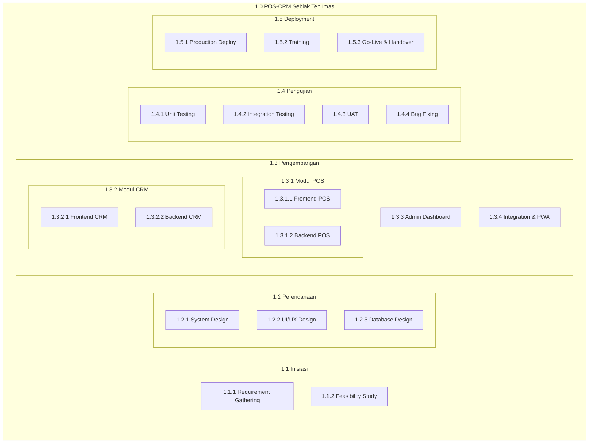
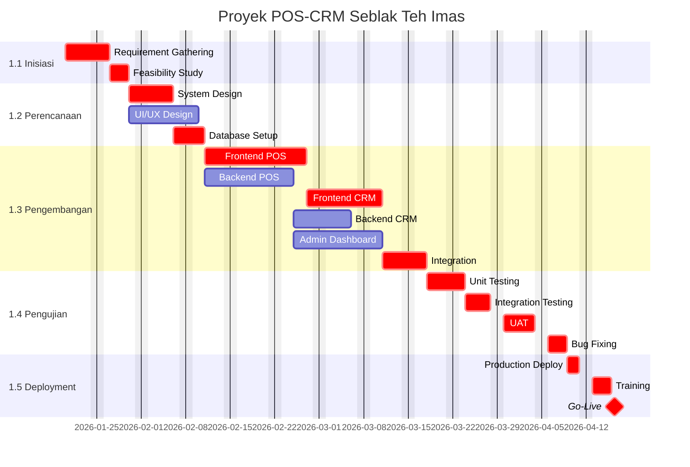
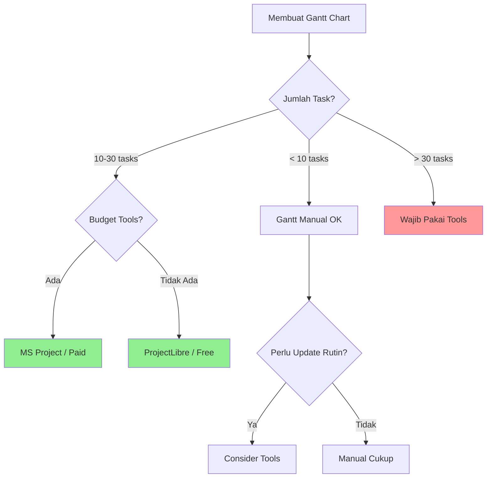

# WBS, GANTT CHART & TOOLS

## Sistem Informasi POS-CRM "Seblak Teh Imas"

---

**Nama Proyek:** Pengembangan Sistem Informasi POS-CRM UMKM "Seblak Teh Imas"  
**Tanggal Dokumen:** 19 Januari 2026  
**Versi:** 1.0  
**CLO:** CLO4 - WBS, Gantt Chart & Tools

---

## 1. Work Breakdown Structure (WBS)

### 1.1 WBS Hierarchical Diagram



### 1.2 WBS Dictionary

#### Level 1: Proyek Utama

| WBS Code | Deliverable             | Deskripsi                                           |
| -------- | ----------------------- | --------------------------------------------------- |
| **1.0**  | POS-CRM Seblak Teh Imas | Sistem informasi POS-CRM lengkap untuk UMKM kuliner |

#### Level 2: Fase Utama

| WBS Code | Fase         | Deskripsi                                 | Duration |
| -------- | ------------ | ----------------------------------------- | -------- |
| **1.1**  | Inisiasi     | Pengumpulan kebutuhan dan studi kelayakan | 8 hari   |
| **1.2**  | Perencanaan  | Desain sistem, UI/UX, dan database        | 15 hari  |
| **1.3**  | Pengembangan | Implementasi kode dan integrasi           | 40 hari  |
| **1.4**  | Pengujian    | Testing dan bug fixing                    | 16 hari  |
| **1.5**  | Deployment   | Deploy, training, dan go-live             | 6 hari   |

#### Level 3 & 4: Work Packages

```
1.0 POS-CRM Seblak Teh Imas (63 hari)
│
├── 1.1 Inisiasi (8 hari)
│   ├── 1.1.1 Requirement Gathering (5 hari)
│   │   ├── 1.1.1.1 Wawancara stakeholder
│   │   ├── 1.1.1.2 Analisis proses bisnis
│   │   ├── 1.1.1.3 Dokumentasi kebutuhan
│   │   └── 1.1.1.4 Validasi requirement
│   │
│   └── 1.1.2 Feasibility Study (3 hari)
│       ├── 1.1.2.1 Analisis kelayakan teknis
│       ├── 1.1.2.2 Analisis kelayakan operasional
│       └── 1.1.2.3 Analisis kelayakan ekonomi
│
├── 1.2 Perencanaan (15 hari)
│   ├── 1.2.1 System Design (5 hari)
│   │   ├── 1.2.1.1 Arsitektur sistem
│   │   ├── 1.2.1.2 Technology stack selection
│   │   └── 1.2.1.3 API design
│   │
│   ├── 1.2.2 UI/UX Design (7 hari)
│   │   ├── 1.2.2.1 Wireframing
│   │   ├── 1.2.2.2 High-fidelity mockup
│   │   ├── 1.2.2.3 Prototype interaktif
│   │   └── 1.2.2.4 Design review
│   │
│   └── 1.2.3 Database Design (3 hari)
│       ├── 1.2.3.1 ERD modeling
│       ├── 1.2.3.2 Schema definition
│       └── 1.2.3.3 Migration scripts
│
├── 1.3 Pengembangan (40 hari)
│   ├── 1.3.1 Modul POS (22 hari)
│   │   ├── 1.3.1.1 Frontend POS (12 hari)
│   │   │   ├── Setup Next.js project
│   │   │   ├── Halaman pemesanan
│   │   │   ├── Keranjang & checkout
│   │   │   ├── Struk digital
│   │   │   └── PWA manifest
│   │   │
│   │   └── 1.3.1.2 Backend POS (10 hari)
│   │       ├── Setup Prisma & PostgreSQL
│   │       ├── API order CRUD
│   │       ├── Queue management
│   │       └── Payment processing
│   │
│   ├── 1.3.2 Modul CRM (15 hari)
│   │   ├── 1.3.2.1 Frontend CRM (8 hari)
│   │   │   ├── Halaman login member
│   │   │   ├── Profil member
│   │   │   ├── Riwayat pesanan
│   │   │   └── Form feedback
│   │   │
│   │   └── 1.3.2.2 Backend CRM (7 hari)
│   │       ├── API customer CRUD
│   │       ├── Membership tier logic
│   │       └── Feedback system
│   │
│   ├── 1.3.3 Admin Dashboard (10 hari)
│   │   ├── Dashboard overview
│   │   ├── Manajemen pesanan
│   │   ├── Laporan & statistik
│   │   └── Manajemen pelanggan
│   │
│   └── 1.3.4 Integration & PWA (5 hari)
│       ├── Frontend-backend integration
│       ├── PWA configuration
│       └── Offline capability
│
├── 1.4 Pengujian (16 hari)
│   ├── 1.4.1 Unit Testing (4 hari)
│   │   ├── Component testing
│   │   └── Function testing
│   │
│   ├── 1.4.2 Integration Testing (4 hari)
│   │   ├── API testing
│   │   └── E2E testing
│   │
│   ├── 1.4.3 User Acceptance Testing (5 hari)
│   │   ├── Test scenario execution
│   │   ├── User feedback collection
│   │   └── Sign-off
│   │
│   └── 1.4.4 Bug Fixing (3 hari)
│       ├── Critical bugs
│       ├── Major bugs
│       └── Minor bugs
│
└── 1.5 Deployment (6 hari)
    ├── 1.5.1 Production Deploy (2 hari)
    │   ├── Environment setup
    │   ├── Database migration
    │   └── DNS & SSL configuration
    │
    ├── 1.5.2 Training (3 hari)
    │   ├── Admin training
    │   ├── User manual
    │   └── Video tutorial
    │
    └── 1.5.3 Go-Live & Handover (1 hari)
        ├── Final checklist
        ├── Documentation handover
        └── Project closure
```

### 1.3 WBS Table Format

| WBS     | Work Package          | PIC          | Duration | Predecessor             | Deliverable        |
| ------- | --------------------- | ------------ | :------: | ----------------------- | ------------------ |
| 1.1.1   | Requirement Gathering | PM           |  5 hari  | -                       | SRS Document       |
| 1.1.2   | Feasibility Study     | Analyst      |  3 hari  | 1.1.1                   | Feasibility Report |
| 1.2.1   | System Design         | Dev Lead     |  5 hari  | 1.1.2                   | Architecture Doc   |
| 1.2.2   | UI/UX Design          | Designer     |  7 hari  | 1.1.2                   | Figma Prototype    |
| 1.2.3   | Database Design       | Backend Dev  |  3 hari  | 1.2.1                   | ERD & Schema       |
| 1.3.1.1 | Frontend POS          | Frontend Dev | 12 hari  | 1.2.2, 1.2.3            | POS Module         |
| 1.3.1.2 | Backend POS           | Backend Dev  | 10 hari  | 1.2.3                   | API POS            |
| 1.3.2.1 | Frontend CRM          | Frontend Dev |  8 hari  | 1.3.1.1                 | CRM Module         |
| 1.3.2.2 | Backend CRM           | Backend Dev  |  7 hari  | 1.3.1.2                 | API CRM            |
| 1.3.3   | Admin Dashboard       | Full-stack   | 10 hari  | 1.3.1.2                 | Dashboard          |
| 1.3.4   | Integration           | Full-stack   |  5 hari  | 1.3.2.1, 1.3.2.2, 1.3.3 | Integrated System  |
| 1.4.1   | Unit Testing          | QA           |  4 hari  | 1.3.4                   | Test Report        |
| 1.4.2   | Integration Testing   | QA           |  4 hari  | 1.4.1                   | Test Report        |
| 1.4.3   | UAT                   | PM + Sponsor |  5 hari  | 1.4.2                   | Sign-off           |
| 1.4.4   | Bug Fixing            | Dev Team     |  3 hari  | 1.4.3                   | Fixed System       |
| 1.5.1   | Production Deploy     | DevOps       |  2 hari  | 1.4.4                   | Live System        |
| 1.5.2   | Training              | PM           |  3 hari  | 1.5.1                   | Trained Users      |
| 1.5.3   | Go-Live               | PM           |  1 hari  | 1.5.2                   | Closed Project     |

---

## 2. Gantt Chart

### 2.1 Gantt Chart Manual (ASCII)

```
Proyek: POS-CRM Seblak Teh Imas
Timeline: 63 hari kerja (Januari - April 2026)
Bar: ████ = Aktivitas, ▓▓▓▓ = Critical Path

Minggu:     W1   W2   W3   W4   W5   W6   W7   W8   W9   W10  W11  W12  W13
Hari:     1----5----10---15---20---25---30---35---40---45---50---55---60---65
          ├────┼────┼────┼────┼────┼────┼────┼────┼────┼────┼────┼────┼────┤

1.1 INISIASI
├─1.1.1 Requirement   ▓▓▓▓▓
├─1.1.2 Feasibility        ▓▓▓

1.2 PERENCANAAN
├─1.2.1 System Design      ▓▓▓▓▓
├─1.2.2 UI/UX Design       ████████
├─1.2.3 DB Setup                ▓▓▓

1.3 PENGEMBANGAN
├─1.3.1.1 Frontend POS              ▓▓▓▓▓▓▓▓▓▓▓▓
├─1.3.1.2 Backend POS               ████████████
├─1.3.2.1 Frontend CRM                            ▓▓▓▓▓▓▓▓
├─1.3.2.2 Backend CRM                             ████████
├─1.3.3 Admin Dashboard                           ██████████
├─1.3.4 Integration                                         ▓▓▓▓▓

1.4 PENGUJIAN
├─1.4.1 Unit Testing                                              ▓▓▓▓
├─1.4.2 Integration Test                                              ▓▓▓▓
├─1.4.3 UAT                                                               ▓▓▓▓▓
├─1.4.4 Bug Fixing                                                              ▓▓▓

1.5 DEPLOYMENT
├─1.5.1 Production Deploy                                                          ▓▓
├─1.5.2 Training                                                                     ▓▓▓
├─1.5.3 Go-Live                                                                        ▓
          ├────┼────┼────┼────┼────┼────┼────┼────┼────┼────┼────┼────┼────┤
Hari:     1----5----10---15---20---25---30---35---40---45---50---55---60---65

LEGENDA:
▓ = Aktivitas Kritis (Critical Path)
█ = Aktivitas Non-Kritis
```

### 2.2 Gantt Chart dengan Detail Tanggal

| WBS     | Aktivitas             | Start  | End    | Durasi |   Progress    |
| ------- | --------------------- | ------ | ------ | :----: | :-----------: |
| 1.1.1   | Requirement Gathering | 20 Jan | 24 Jan |   5    | ░░░░░░░░░░ 0% |
| 1.1.2   | Feasibility Study     | 27 Jan | 29 Jan |   3    | ░░░░░░░░░░ 0% |
| 1.2.1   | System Design         | 30 Jan | 5 Feb  |   5    | ░░░░░░░░░░ 0% |
| 1.2.2   | UI/UX Design          | 30 Jan | 7 Feb  |   7    | ░░░░░░░░░░ 0% |
| 1.2.3   | Database Setup        | 6 Feb  | 10 Feb |   3    | ░░░░░░░░░░ 0% |
| 1.3.1.1 | Frontend POS          | 11 Feb | 26 Feb |   12   | ░░░░░░░░░░ 0% |
| 1.3.1.2 | Backend POS           | 11 Feb | 24 Feb |   10   | ░░░░░░░░░░ 0% |
| 1.3.2.1 | Frontend CRM          | 27 Feb | 10 Mar |   8    | ░░░░░░░░░░ 0% |
| 1.3.2.2 | Backend CRM           | 25 Feb | 5 Mar  |   7    | ░░░░░░░░░░ 0% |
| 1.3.3   | Admin Dashboard       | 25 Feb | 10 Mar |   10   | ░░░░░░░░░░ 0% |
| 1.3.4   | Integration           | 11 Mar | 17 Mar |   5    | ░░░░░░░░░░ 0% |
| 1.4.1   | Unit Testing          | 18 Mar | 23 Mar |   4    | ░░░░░░░░░░ 0% |
| 1.4.2   | Integration Testing   | 24 Mar | 27 Mar |   4    | ░░░░░░░░░░ 0% |
| 1.4.3   | UAT                   | 28 Mar | 3 Apr  |   5    | ░░░░░░░░░░ 0% |
| 1.4.4   | Bug Fixing            | 4 Apr  | 8 Apr  |   3    | ░░░░░░░░░░ 0% |
| 1.5.1   | Production Deploy     | 9 Apr  | 10 Apr |   2    | ░░░░░░░░░░ 0% |
| 1.5.2   | Training              | 11 Apr | 15 Apr |   3    | ░░░░░░░░░░ 0% |
| 1.5.3   | Go-Live               | 16 Apr | 16 Apr |   1    | ░░░░░░░░░░ 0% |

### 2.3 Mermaid Gantt Chart



---

## 3. Implementasi Microsoft Project

### 3.1 Panduan Input Data ke Microsoft Project

#### Langkah 1: Setup Project

1. Buka Microsoft Project
2. File → New → Blank Project
3. Project → Project Information
   - Start Date: 20 Januari 2026
   - Calendar: Standard (Mon-Fri, 8 hours/day)

#### Langkah 2: Define Calendar

1. Project → Change Working Time
2. Exceptions: Tanggal libur nasional
3. Work Weeks: Senin-Jumat, 08:00-17:00

#### Langkah 3: Input Task List

```
Task Name                          | Duration | Predecessors
─────────────────────────────────────────────────────────────
1.0 POS-CRM Seblak Teh Imas       |          |
   1.1 Inisiasi                    |          |
      1.1.1 Requirement Gathering  | 5 days   |
      1.1.2 Feasibility Study      | 3 days   | 3
   1.2 Perencanaan                 |          |
      1.2.1 System Design          | 5 days   | 4
      1.2.2 UI/UX Design           | 7 days   | 4
      1.2.3 Database Setup         | 3 days   | 6
   1.3 Pengembangan                |          |
      1.3.1.1 Frontend POS         | 12 days  | 7,8
      1.3.1.2 Backend POS          | 10 days  | 8
      1.3.2.1 Frontend CRM         | 8 days   | 10
      1.3.2.2 Backend CRM          | 7 days   | 11
      1.3.3 Admin Dashboard        | 10 days  | 11
      1.3.4 Integration            | 5 days   | 12,13,14
   1.4 Pengujian                   |          |
      1.4.1 Unit Testing           | 4 days   | 15
      1.4.2 Integration Testing    | 4 days   | 17
      1.4.3 UAT                    | 5 days   | 18
      1.4.4 Bug Fixing             | 3 days   | 19
   1.5 Deployment                  |          |
      1.5.1 Production Deploy      | 2 days   | 20
      1.5.2 Training               | 3 days   | 22
      1.5.3 Go-Live                | 1 day    | 23
```

#### Langkah 4: Assign Resources

| Resource Name      | Type | Rate         |
| ------------------ | ---- | ------------ |
| Project Manager    | Work | Rp 50.000/hr |
| Project Planner    | Work | Rp 40.000/hr |
| Cost Analyst       | Work | Rp 40.000/hr |
| UI/UX Designer     | Work | Rp 75.000/hr |
| Frontend Developer | Work | Rp 80.000/hr |
| Backend Developer  | Work | Rp 80.000/hr |
| QA Tester          | Work | Rp 50.000/hr |

#### Langkah 5: Generate Reports

1. View → Gantt Chart (untuk visualisasi)
2. View → Network Diagram (untuk CPM)
3. Report → Dashboards → Project Overview

### 3.2 Export dari MS Project

**Format yang dapat di-export:**

- PDF (untuk laporan)
- Excel (untuk analisis lanjutan)
- XML (untuk backup)
- MPP (native format)

### 3.3 Screenshot Referensi MS Project

> **Catatan:** Untuk implementasi aktual, buat file .mpp dan capture screenshot untuk:
>
> 1. Gantt Chart View
> 2. Network Diagram View
> 3. Resource Usage View
> 4. Cost Overview Report

---

## 4. Alternatif Tools (Jika Tidak Ada MS Project)

### 4.1 GanttProject (Free, Offline)

**Website:** https://www.ganttproject.biz/

**Kelebihan:**

- Gratis dan open-source
- Mirip dengan MS Project
- Export ke PDF, PNG, CSV

**Langkah:**

1. Download dan install
2. File → New Project
3. Input tasks dengan cara sama seperti MS Project

### 4.2 ProjectLibre (Free, Offline)

**Website:** https://www.projectlibre.com/

**Kelebihan:**

- Sangat mirip MS Project
- Dapat membuka file .mpp
- Fitur lengkap untuk CPM

### 4.3 Online Tools

| Tool              | URL           | Free Tier  |
| ----------------- | ------------- | ---------- |
| Monday.com        | monday.com    | 2 users    |
| Asana             | asana.com     | 15 users   |
| TeamGantt         | teamgantt.com | 3 projects |
| Trello + Planyway | trello.com    | Unlimited  |

---

## 5. Perbandingan Gantt Chart Manual vs Tools

> **CRITICAL POINT:** Membandingkan hasil Gantt Chart manual vs tools dan menentukan mana yang lebih akurat.

### 5.1 Perbandingan Fitur

| Aspek                 | Gantt Manual (ASCII/Excel)   | Gantt Tools (MS Project) |
| --------------------- | ---------------------------- | ------------------------ |
| **Visualisasi**       | Sederhana, terbatas          | Profesional, interaktif  |
| **Akurasi**           | Prone to human error         | Kalkulasi otomatis       |
| **Update**            | Harus manual, time-consuming | Real-time, drag & drop   |
| **Dependency**        | Sulit divisualisasi          | Arrows & links otomatis  |
| **Critical Path**     | Hitung manual                | Auto-calculated          |
| **Resource Leveling** | Tidak bisa                   | Otomatis                 |
| **Cost Tracking**     | Spreadsheet terpisah         | Integrated               |
| **Reporting**         | Manual format                | Template siap pakai      |
| **Collaboration**     | Share file                   | Real-time sync           |
| **Learning Curve**    | Rendah                       | Sedang-Tinggi            |
| **Biaya**             | Gratis                       | Berbayar (MS365)         |

### 5.2 Analisis Akurasi

#### Gantt Manual

```
Kelebihan:
+ Tidak butuh software khusus
+ Mudah dipahami untuk proyek kecil
+ Cepat dibuat untuk presentasi sederhana

Kekurangan:
- Error pada perhitungan ES/EF jika task banyak
- Tidak auto-update saat ada perubahan
- Sulit track progress percentage
- Tidak bisa simulate "what-if" scenarios
```

**Contoh Error Potensial:**

- Salah hitung predecessor → timeline tidak akurat
- Lupa update ketika ada perubahan → ketidaksesuaian
- Tidak memperhitungkan weekend → tanggal salah

#### Gantt Tools

```
Kelebihan:
+ Kalkulasi otomatis (ES, EF, LS, LF, Float)
+ Critical path auto-highlighted
+ Resource conflict detection
+ Progress tracking real-time
+ Scenario analysis (baseline comparison)
+ Professional export

Kekurangan:
- Butuh lisensi (untuk MS Project)
- Learning curve untuk fitur advanced
- Overkill untuk proyek sangat kecil
```

### 5.3 Studi Kasus: Error pada Gantt Manual

**Skenario:** Tim membuat Gantt manual untuk proyek POS-CRM

| Situasi                        | Gantt Manual               | Gantt Tools    |
| ------------------------------ | -------------------------- | -------------- |
| Task F predecessor salah input | Tidak terdeteksi           | Warning muncul |
| Weekend termasuk dalam durasi  | 63 hari → 87 kalender hari | Auto-exclude   |
| Perubahan durasi task C        | Update 10+ sel manual      | Auto cascade   |
| Identifikasi critical path     | Hitung ulang 30 menit      | 1 klik         |

**Hasil:**

- Gantt Manual: 2 error dalam perhitungan tanggal
- Gantt Tools: 0 error

### 5.4 Rekomendasi: Kapan Menggunakan Apa?



### 5.5 Kesimpulan Perbandingan

| Kriteria             |  Winner   | Alasan                             |
| -------------------- | :-------: | ---------------------------------- |
| **Akurasi**          | 🏆 Tools  | Kalkulasi otomatis, no human error |
| **Kecepatan Update** | 🏆 Tools  | Drag & drop, auto-cascade          |
| **Critical Path**    | 🏆 Tools  | Auto-calculated & highlighted      |
| **Biaya**            | 🏆 Manual | Gratis (tapi ada free tools)       |
| **Learning Curve**   | 🏆 Manual | Langsung bisa                      |
| **Profesionalisme**  | 🏆 Tools  | Output lebih rapi                  |

> [!IMPORTANT]
> **Rekomendasi untuk Proyek POS-CRM:**
>
> Gunakan **TOOLS** (MS Project atau alternatif gratis seperti ProjectLibre) karena:
>
> 1. Proyek memiliki 18+ aktivitas
> 2. Ada banyak dependency kompleks
> 3. Perlu tracking progress selama 10+ minggu
> 4. Critical path perlu jelas untuk manajemen risiko

---

## 6. Ringkasan WBS & Gantt

| Parameter           | Nilai                     |
| ------------------- | ------------------------- |
| Total Work Packages | 18 work packages          |
| Total Work Hours    | ~895 jam                  |
| Project Duration    | 63 hari kerja             |
| Start Date          | 20 Januari 2026           |
| End Date            | 16 April 2026             |
| Critical Tasks      | 16 dari 18 tasks          |
| Recommended Tool    | MS Project / ProjectLibre |

---

_Dokumen ini adalah bagian dari Final Project mata kuliah Manajemen Proyek Sistem Informasi (MPSI)_

**Disiapkan oleh:** Lutpandea Putra Sutriyana (Project Planner)  
**Direview oleh:** M. Z. Haikal Hamdani (Project Manager)  
**Tanggal:** 19 Januari 2026
