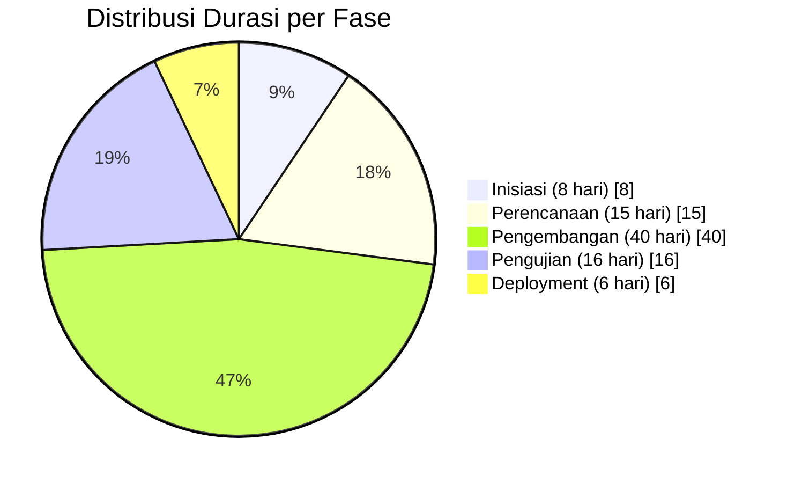
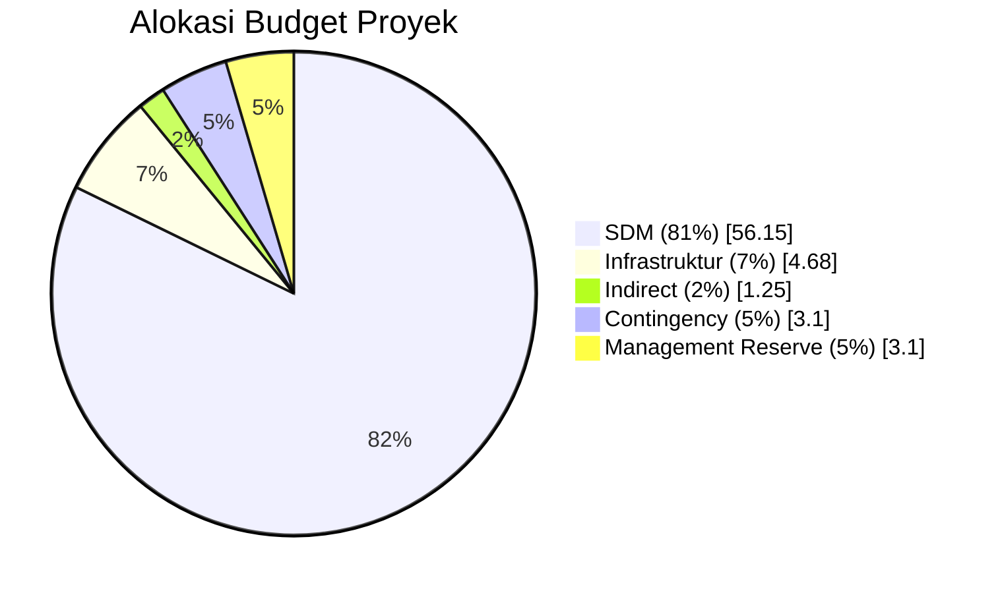
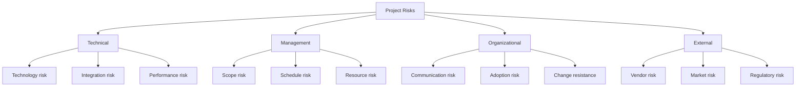
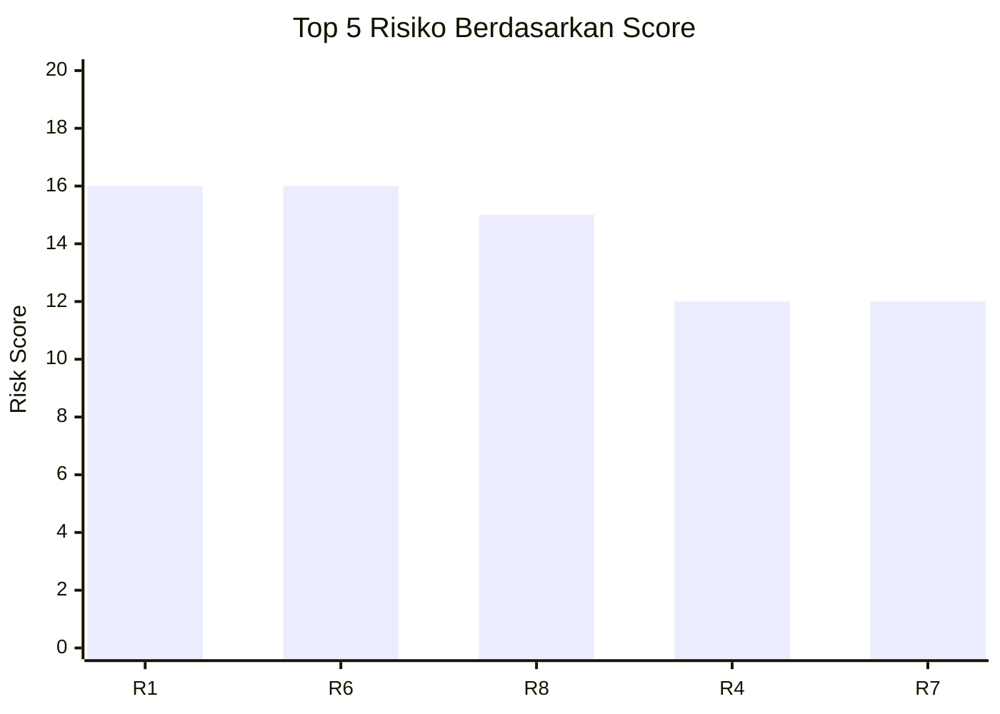
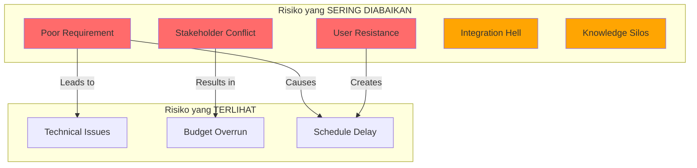

# ESTIMASI & MANAJEMEN RISIKO

## Sistem Informasi POS-CRM "Seblak Teh Imas"

---

**Nama Proyek:** Pengembangan Sistem Informasi POS-CRM UMKM "Seblak Teh Imas"  
**Tanggal Dokumen:** 19 Januari 2026  
**Versi:** 1.0  
**CLO:** CLO4 - Estimasi & Manajemen Risiko

---

## 1. Estimasi Durasi Proyek

### 1.1 Metode Estimasi

Estimasi durasi menggunakan kombinasi metode:

| Metode                     | Deskripsi                                      | Penggunaan           |
| -------------------------- | ---------------------------------------------- | -------------------- |
| **Analogous Estimation**   | Berdasarkan proyek serupa sebelumnya           | Baseline durasi      |
| **Parametric Estimation**  | Rumus berdasarkan metrik (LOC, story points)   | Development tasks    |
| **Three-Point Estimation** | (Optimistic + 4×Most Likely + Pessimistic) / 6 | Task berisiko tinggi |
| **Expert Judgment**        | Pengalaman tim developer                       | Validasi hasil       |

### 1.2 Three-Point Estimation

#### Formula: PERT (Program Evaluation and Review Technique)

```
Expected Duration (TE) = (O + 4M + P) / 6
Standard Deviation (σ) = (P - O) / 6
```

| Task                  | Optimistic (O) | Most Likely (M) | Pessimistic (P) | Expected (TE) |  σ   |
| --------------------- | :------------: | :-------------: | :-------------: | :-----------: | :--: |
| Requirement Gathering |       3        |        5        |        8        |      5.2      | 0.83 |
| UI/UX Design          |       5        |        7        |       12        |      7.5      | 1.17 |
| Frontend POS          |       9        |       12        |       18        |     12.5      | 1.50 |
| Backend POS           |       7        |       10        |       15        |     10.3      | 1.33 |
| Frontend CRM          |       6        |        8        |       12        |      8.3      | 1.00 |
| Integration           |       3        |        5        |        9        |      5.3      | 1.00 |
| UAT                   |       3        |        5        |       10        |      5.5      | 1.17 |

### 1.3 Ringkasan Durasi Proyek

```
┌─────────────────────────────────────────────────────────────────┐
│                    ESTIMASI DURASI PROYEK                        │
├─────────────────────────────────────────────────────────────────┤
│                                                                  │
│   Durasi Baseline     : 63 hari kerja                           │
│   Durasi dengan Buffer: 70 hari kerja (+10% contingency)        │
│                                                                  │
│   Dalam Minggu        : 12.6 minggu (ideal) - 14 minggu (safe)  │
│   Dalam Bulan         : ~3 bulan                                 │
│                                                                  │
│   Start Date          : 20 Januari 2026                          │
│   Target End Date     : 16 April 2026 (baseline)                │
│   Safe End Date       : 25 April 2026 (with buffer)             │
│                                                                  │
└─────────────────────────────────────────────────────────────────┘
```

### 1.4 Breakdown Durasi per Fase



| Fase         | Durasi  | % dari Total |   Kumulatif    |
| ------------ | :-----: | :----------: | :------------: |
| Inisiasi     | 8 hari  |    12.7%     |     12.7%      |
| Perencanaan  | 15 hari |    23.8%     |     36.5%      |
| Pengembangan | 40 hari |    63.5%     | 100% (overlap) |
| Pengujian    | 16 hari |    25.4%     |       -        |
| Deployment   | 6 hari  |     9.5%     |       -        |

---

## 2. Estimasi Biaya Proyek

### 2.1 Metode Estimasi Biaya

| Metode                             | Akurasi      | Fase Penggunaan |
| ---------------------------------- | ------------ | --------------- |
| **Rough Order of Magnitude (ROM)** | -25% to +75% | Pre-project     |
| **Budget Estimate**                | -10% to +25% | Planning        |
| **Definitive Estimate**            | -5% to +10%  | Execution       |

### 2.2 Breakdown Biaya Detail

#### A. Biaya Sumber Daya Manusia (SDM)

| Peran               |     Jam |  Rate/Jam |          Subtotal |
| ------------------- | ------: | --------: | ----------------: |
| Project Manager     |     100 | Rp 50.000 |      Rp 5.000.000 |
| Project Planner     |     150 | Rp 40.000 |      Rp 6.000.000 |
| Cost & Risk Analyst |     120 | Rp 40.000 |      Rp 4.800.000 |
| UI/UX Designer      |      60 | Rp 75.000 |      Rp 4.500.000 |
| Frontend Developer  |     210 | Rp 80.000 |     Rp 16.800.000 |
| Backend Developer   |     210 | Rp 80.000 |     Rp 16.800.000 |
| QA Tester           |      45 | Rp 50.000 |      Rp 2.250.000 |
| **TOTAL SDM**       | **895** |           | **Rp 56.150.000** |

#### B. Biaya Infrastruktur & Operasional

| Item                    |  Qty  |        Harga |         Subtotal |
| ----------------------- | :---: | -----------: | ---------------: |
| Domain .com (1 tahun)   |   1   |   Rp 150.000 |       Rp 150.000 |
| Vercel Pro (opsional)   | 3 bln |   Rp 300.000 |       Rp 900.000 |
| Supabase Pro (opsional) | 3 bln |   Rp 375.000 |     Rp 1.125.000 |
| Tablet Android 10"      |   1   | Rp 2.500.000 |     Rp 2.500.000 |
| **TOTAL INFRA**         |       |              | **Rp 4.675.000** |

#### C. Biaya Tidak Langsung

| Item                         |         Estimasi |
| ---------------------------- | ---------------: |
| Overhead (listrik, internet) |       Rp 500.000 |
| Meeting & komunikasi         |       Rp 300.000 |
| Dokumentasi & cetak          |       Rp 200.000 |
| Training materials           |       Rp 250.000 |
| **TOTAL INDIRECT**           | **Rp 1.250.000** |

### 2.3 Total Budget Proyek

```
┌─────────────────────────────────────────────────────────────────┐
│                    ESTIMASI BIAYA PROYEK                         │
├─────────────────────────────────────────────────────────────────┤
│                                                                  │
│   Biaya SDM               : Rp 56.150.000                       │
│   Biaya Infrastruktur     : Rp  4.675.000                       │
│   Biaya Tidak Langsung    : Rp  1.250.000                       │
│   ─────────────────────────────────────────                     │
│   Subtotal                : Rp 62.075.000                       │
│                                                                  │
│   Contingency Reserve (5%): Rp  3.103.750                       │
│   Management Reserve (5%) : Rp  3.103.750                       │
│   ─────────────────────────────────────────                     │
│   TOTAL BUDGET            : Rp 68.282.500                       │
│                                                                  │
│   Rounded Budget          : Rp 70.000.000                       │
│                                                                  │
└─────────────────────────────────────────────────────────────────┘
```

### 2.4 Budget Allocation Chart



### 2.5 Cash Flow Timeline

| Bulan  | Aktivitas                   |   Pengeluaran |     Kumulatif |
| :----: | --------------------------- | ------------: | ------------: |
|  Jan   | Inisiasi, Perencanaan       | Rp 12.000.000 | Rp 12.000.000 |
|  Feb   | Pengembangan Awal           | Rp 25.000.000 | Rp 37.000.000 |
|  Mar   | Pengembangan Akhir, Testing | Rp 20.000.000 | Rp 57.000.000 |
|  Apr   | Deployment, Training        |  Rp 8.000.000 | Rp 65.000.000 |
| Buffer | Reserve                     |  Rp 5.000.000 | Rp 70.000.000 |

---

## 3. Identifikasi Risiko Utama

### 3.1 Risk Identification Matrix

| ID  | Kategori      | Risiko                         | Deskripsi                                         |
| --- | ------------- | ------------------------------ | ------------------------------------------------- |
| R1  | Scope         | **Scope Creep**                | Penambahan fitur di luar scope awal tanpa kontrol |
| R2  | Technical     | **Technical Debt**             | Kualitas kode menurun karena deadline ketat       |
| R3  | Resource      | **Key Person Unavailable**     | Developer utama sakit/berhalangan                 |
| R4  | Technical     | **Integration Failure**        | Frontend-backend tidak kompatibel                 |
| R5  | External      | **Third-party Dependency**     | Downtime Vercel/Supabase                          |
| R6  | Business      | **Low User Adoption**          | User menolak menggunakan sistem                   |
| R7  | Schedule      | **Schedule Slippage**          | Keterlambatan milestone kritis                    |
| R8  | Quality       | **Critical Bug in Production** | Bug fatal ditemukan saat go-live                  |
| R9  | Security      | **Data Breach**                | Kebocoran data pelanggan                          |
| R10 | Communication | **Poor Communication**         | Miskomunikasi requirement                         |

### 3.2 Risk Categories (RBS - Risk Breakdown Structure)



---

## 4. Analisis Risiko (Probabilitas × Dampak)

### 4.1 Risk Probability & Impact Scale

#### Skala Probabilitas

| Level | Probabilitas | Deskripsi                 |
| :---: | :----------: | ------------------------- |
|   1   |    0-10%     | Sangat jarang terjadi     |
|   2   |    11-30%    | Jarang terjadi            |
|   3   |    31-50%    | Mungkin terjadi           |
|   4   |    51-70%    | Kemungkinan besar terjadi |
|   5   |   71-100%    | Hampir pasti terjadi      |

#### Skala Dampak

| Level |   Dampak   | Schedule   | Cost          | Quality              |
| :---: | :--------: | ---------- | ------------- | -------------------- |
|   1   | Negligible | < 1 hari   | < 1% budget   | Minor defect         |
|   2   |    Low     | 1-3 hari   | 1-5% budget   | Beberapa defect      |
|   3   |   Medium   | 3-7 hari   | 5-10% budget  | Major defect         |
|   4   |    High    | 1-2 minggu | 10-20% budget | Unacceptable quality |
|   5   |  Critical  | > 2 minggu | > 20% budget  | Project failure      |

### 4.2 Risk Assessment Matrix

| ID  | Risiko                 | Prob (P) | Impact (I) | Score (P×I) | Priority  |
| --- | ---------------------- | :------: | :--------: | :---------: | :-------: |
| R1  | Scope Creep            | 4 (60%)  |     4      |   **16**    |  🔴 HIGH  |
| R2  | Technical Debt         | 3 (50%)  |     3      |    **9**    | 🟡 MEDIUM |
| R3  | Key Person Unavailable | 2 (25%)  |     4      |    **8**    | 🟡 MEDIUM |
| R4  | Integration Failure    | 3 (40%)  |     4      |   **12**    |  🔴 HIGH  |
| R5  | Third-party Dependency | 2 (20%)  |     3      |    **6**    |  🟢 LOW   |
| R6  | Low User Adoption      | 4 (55%)  |     4      |   **16**    |  🔴 HIGH  |
| R7  | Schedule Slippage      | 4 (60%)  |     3      |   **12**    |  🔴 HIGH  |
| R8  | Critical Bug           | 3 (40%)  |     5      |   **15**    |  🔴 HIGH  |
| R9  | Data Breach            | 1 (10%)  |     5      |    **5**    |  🟢 LOW   |
| R10 | Poor Communication     | 3 (40%)  |     3      |    **9**    | 🟡 MEDIUM |

### 4.3 Risk Matrix Visualization

```
              IMPACT
              Low ◄─────────────────────► High
         ┌────────────────────────────────────┐
    High │         │ R7     │ R1,R6  │ R8     │
     ▲   │─────────┼────────┼────────┼────────│
     │   │         │ R2,R10 │ R4     │        │
  P  │   │─────────┼────────┼────────┼────────│
  R  │   │ R5      │ R3     │        │        │
  O  │   │─────────┼────────┼────────┼────────│
  B  │   │         │        │        │ R9     │
     ▼   │         │        │        │        │
    Low  └────────────────────────────────────┘

         🟢 = 1-5 (Accept)
         🟡 = 6-12 (Mitigate)
         🔴 = 13-25 (Priority Action)
```

### 4.4 Top 5 Risks by Score



---

## 5. Strategi Mitigasi Risiko

### 5.1 Risk Response Strategies

| Strategy     | Deskripsi                                    | Contoh                     |
| ------------ | -------------------------------------------- | -------------------------- |
| **Avoid**    | Menghilangkan risiko dengan mengubah rencana | Tidak pakai teknologi baru |
| **Transfer** | Memindahkan risiko ke pihak lain             | Asuransi, outsource        |
| **Mitigate** | Mengurangi probabilitas atau dampak          | Testing, backup plan       |
| **Accept**   | Menerima risiko (dengan/tanpa contingency)   | Buffer time                |

### 5.2 Mitigation Plan per Risiko

#### R1: Scope Creep (Score: 16) 🔴

| Aspek           | Detail                                                                                                                                   |
| --------------- | ---------------------------------------------------------------------------------------------------------------------------------------- |
| **Strategy**    | Avoid + Mitigate                                                                                                                         |
| **Prevention**  | - Scope baseline yang jelas & signed-off<br>- Change Control Board (CCB) untuk setiap perubahan<br>- "Freeze" requirement setelah design |
| **Contingency** | - Buffer time 7 hari untuk minor changes<br>- Phase 2 untuk fitur nice-to-have                                                           |
| **Owner**       | Project Manager                                                                                                                          |
| **Trigger**     | Ada request fitur baru dari sponsor                                                                                                      |

#### R6: Low User Adoption (Score: 16) 🔴

| Aspek           | Detail                                                                                                                                |
| --------------- | ------------------------------------------------------------------------------------------------------------------------------------- |
| **Strategy**    | Mitigate                                                                                                                              |
| **Prevention**  | - Early user involvement dalam design<br>- Iterative prototype & feedback<br>- Simple & intuitive UI<br>- Training yang comprehensive |
| **Contingency** | - Extended training period<br>- On-site support 1 minggu<br>- Quick-fix untuk usability issues                                        |
| **Owner**       | Project Planner + Sponsor                                                                                                             |
| **Trigger**     | Feedback negatif saat UAT                                                                                                             |

#### R8: Critical Bug in Production (Score: 15) 🔴

| Aspek           | Detail                                                                                                                                                |
| --------------- | ----------------------------------------------------------------------------------------------------------------------------------------------------- |
| **Strategy**    | Mitigate                                                                                                                                              |
| **Prevention**  | - Multi-layer testing (Unit, Integration, E2E)<br>- Code review mandatory<br>- Staging environment sebelum production<br>- Smoke test post-deployment |
| **Contingency** | - Rollback procedure<br>- Hotfix process (< 4 jam)<br>- 24-hour on-call support                                                                       |
| **Owner**       | QA Lead + Backend Developer                                                                                                                           |
| **Trigger**     | Critical bug reported post go-live                                                                                                                    |

#### R4: Integration Failure (Score: 12) 🔴

| Aspek           | Detail                                                                                                                                                  |
| --------------- | ------------------------------------------------------------------------------------------------------------------------------------------------------- |
| **Strategy**    | Mitigate                                                                                                                                                |
| **Prevention**  | - API contract/specification upfront<br>- Integration testing early & often<br>- Mock services untuk parallel development<br>- Daily sync meeting FE-BE |
| **Contingency** | - 3 hari buffer untuk integration issues<br>- Escalation ke senior developer                                                                            |
| **Owner**       | Tech Lead                                                                                                                                               |
| **Trigger**     | API mismatch detected                                                                                                                                   |

#### R7: Schedule Slippage (Score: 12) 🔴

| Aspek           | Detail                                                                                                                         |
| --------------- | ------------------------------------------------------------------------------------------------------------------------------ |
| **Strategy**    | Mitigate + Accept                                                                                                              |
| **Prevention**  | - Realistic estimation (PERT)<br>- Daily standup untuk early warning<br>- Track progress weekly<br>- Identify bottleneck early |
| **Contingency** | - 7 hari buffer dalam schedule<br>- Crashing options identified<br>- Scope reduction plan ready                                |
| **Owner**       | Project Manager                                                                                                                |
| **Trigger**     | Task delay > 2 hari tanpa recovery                                                                                             |

### 5.3 Risk Register Summary

| ID  | Risk           | Strategy | Mitigation Action      | Contingency          | Owner     | Status |
| --- | -------------- | -------- | ---------------------- | -------------------- | --------- | ------ |
| R1  | Scope Creep    | Avoid    | CCB, Scope freeze      | Phase 2 list         | PM        | Open   |
| R2  | Technical Debt | Mitigate | Code review            | Refactoring sprint   | Tech Lead | Open   |
| R3  | Key Person     | Transfer | Cross-training         | Backup resource      | PM        | Open   |
| R4  | Integration    | Mitigate | API contract           | 3-day buffer         | Tech Lead | Open   |
| R5  | Third-party    | Accept   | Monitoring             | Alternative services | DevOps    | Open   |
| R6  | Low Adoption   | Mitigate | User involvement       | Extended training    | PM        | Open   |
| R7  | Schedule       | Mitigate | Daily tracking         | 7-day buffer         | PM        | Open   |
| R8  | Critical Bug   | Mitigate | Multi-layer test       | Rollback plan        | QA        | Open   |
| R9  | Data Breach    | Avoid    | Security best practice | Incident response    | DevOps    | Open   |
| R10 | Communication  | Mitigate | Regular meetings       | Escalation path      | PM        | Open   |

---

## 6. Risiko Fatal yang Sering Diabaikan

> **CRITICAL POINT:** Risiko mana yang sering diabaikan mahasiswa tapi paling fatal di dunia nyata?

### 6.1 The "Hidden Killers" of IT Projects



### 6.2 Analisis 5 Risiko yang Sering Diabaikan

#### 1️⃣ Poor Requirement Gathering (Paling Fatal!)

```
┌─────────────────────────────────────────────────────────────────┐
│  🔴 RISIKO PALING FATAL: POOR REQUIREMENT GATHERING             │
├─────────────────────────────────────────────────────────────────┤
│                                                                  │
│  Kenapa Diabaikan:                                              │
│  • Mahasiswa ingin "langsung coding"                            │
│  • Dianggap membuang waktu                                      │
│  • "Nanti bisa diubah sambil jalan"                            │
│                                                                  │
│  Dampak Nyata:                                                   │
│  • 60% project failure karena requirement issues                 │
│  • Rework cost bisa 100x lipat jika ditemukan di production    │
│  • "What you build is not what they need"                       │
│                                                                  │
│  Contoh Kasus:                                                   │
│  Developer membuat login dengan email, ternyata user hanya      │
│  punya nomor HP → Harus rebuild authentication system           │
│                                                                  │
│  Pencegahan:                                                     │
│  ✓ Wawancara mendalam dengan end user                          │
│  ✓ Prototype sebelum development                                │
│  ✓ Sign-off requirement document                                │
│  ✓ "Walk a mile in user's shoes"                               │
│                                                                  │
└─────────────────────────────────────────────────────────────────┘
```

#### 2️⃣ Stakeholder Expectation Mismatch

| Aspek                | Detail                                             |
| -------------------- | -------------------------------------------------- |
| **Kenapa Diabaikan** | Fokus pada teknis, abaikan politik & komunikasi    |
| **Dampak**           | Sistem bagus tapi tidak diterima stakeholder       |
| **Statistik**        | 29% project gagal karena stakeholder tidak aligned |
| **Pencegahan**       | Regular demo, manage expectation, include sponsor  |

#### 3️⃣ User Resistance to Change

| Aspek                | Detail                                              |
| -------------------- | --------------------------------------------------- |
| **Kenapa Diabaikan** | "Sistem bagus pasti akan dipakai"                   |
| **Dampak**           | User kembali ke cara manual, investasi sia-sia      |
| **Statistik**        | 33% ERP implementation gagal karena user resistance |
| **Pencegahan**       | Early involvement, training, gradual rollout        |

#### 4️⃣ Integration Complexity Underestimation

| Aspek                | Detail                                            |
| -------------------- | ------------------------------------------------- |
| **Kenapa Diabaikan** | "Tinggal connect API saja"                        |
| **Dampak**           | 40% waktu development habis di integration issues |
| **Statistik**        | API integration bugs adalah #1 source of delay    |
| **Pencegahan**       | Integration testing early, contract-first design  |

#### 5️⃣ Knowledge Concentration (Bus Factor)

| Aspek                | Detail                                             |
| -------------------- | -------------------------------------------------- |
| **Kenapa Diabaikan** | "Lagipula tidak mungkin dia keluar"                |
| **Dampak**           | Satu orang sakit = proyek berhenti                 |
| **Statistik**        | Proyek dengan bus factor = 1 punya 3x failure rate |
| **Pencegahan**       | Pair programming, dokumentasi, cross-training      |

### 6.3 The Real-World vs Academic View

| Risiko             | Academic View | Real-World Reality       |
| ------------------ | ------------- | ------------------------ |
| Technical bugs     | ⭐⭐⭐⭐⭐    | ⭐⭐⭐ (fixable)         |
| Poor requirement   | ⭐⭐          | ⭐⭐⭐⭐⭐ (root cause)  |
| Budget overrun     | ⭐⭐⭐        | ⭐⭐⭐                   |
| User resistance    | ⭐            | ⭐⭐⭐⭐⭐ (killer)      |
| Communication gap  | ⭐            | ⭐⭐⭐⭐ (silent killer) |
| Integration issues | ⭐⭐          | ⭐⭐⭐⭐                 |

### 6.4 Lesson Learned untuk Proyek POS-CRM

> [!CAUTION]
> **Untuk proyek POS-CRM Seblak Teh Imas ini, risiko yang HARUS diawasi:**
>
> 1. **Requirement Mismatch**: Pastikan Teh Imas (pemilik) memahami dan setuju dengan setiap fitur SEBELUM development
> 2. **User Adoption**: Teh Imas dan karyawan mungkin terbiasa dengan kertas. Training adalah KRITIS.
> 3. **Smartphone Literacy**: Validasi bahwa operator kasir bisa menggunakan tablet/smartphone dengan baik

### 6.5 Pre-Mortem Analysis

**Bayangkan proyek ini GAGAL. Apa yang mungkin terjadi?**

```
┌─────────────────────────────────────────────────────────────────┐
│  PRE-MORTEM: Mengapa Proyek POS-CRM Bisa Gagal?                 │
├─────────────────────────────────────────────────────────────────┤
│                                                                  │
│  Skenario 1: "Beda Ekspektasi"                                  │
│  • Teh Imas expect sistem seperti Gojek/Grab                    │
│  • Tim deliver sistem sederhana                                 │
│  • Gap terlalu besar → proyek dianggap gagal                   │
│  → SOLUSI: Demo prototype di minggu ke-2                        │
│                                                                  │
│  Skenario 2: "Tidak Mau Pakai"                                  │
│  • Sistem jadi tapi Teh Imas tetap pakai kertas                │
│  • "Ribet", "Takut salah", "Lebih cepat manual"                │
│  → SOLUSI: Training mendalam + 1 minggu pendampingan            │
│                                                                  │
│  Skenario 3: "Server Down Saat Ramai"                           │
│  • Peak hour jam 12 siang, database limit tercapai              │
│  • Pelanggan antri, sistem error                                │
│  → SOLUSI: Load testing + fallback manual procedure             │
│                                                                  │
│  Skenario 4: "Developer Sakit"                                  │
│  • Backend developer sakit 2 minggu                             │
│  • Tidak ada yang bisa melanjutkan                              │
│  → SOLUSI: Pair programming, code documentation                 │
│                                                                  │
└─────────────────────────────────────────────────────────────────┘
```

---

## 7. Ringkasan Manajemen Risiko

### 7.1 Risk Summary Dashboard

| Metric                          | Value        |
| ------------------------------- | ------------ |
| Total Risks Identified          | 10 risiko    |
| High Priority Risks (Score ≥12) | 5 risiko     |
| Medium Priority Risks           | 3 risiko     |
| Low Priority Risks              | 2 risiko     |
| Average Risk Score              | 10.8         |
| Risks with Mitigation Plan      | 10/10 (100%) |

### 7.2 Budget untuk Risk Management

| Item                  | Allocation             |
| --------------------- | ---------------------- |
| Contingency Reserve   | Rp 3.103.750 (5%)      |
| Management Reserve    | Rp 3.103.750 (5%)      |
| **Total Risk Budget** | **Rp 6.207.500 (10%)** |

### 7.3 Risk Monitoring Plan

| Frequency     | Activity             | PIC              |
| ------------- | -------------------- | ---------------- |
| Daily         | Review task progress | Team             |
| Weekly        | Risk status update   | PM               |
| Bi-weekly     | Risk review meeting  | All Stakeholders |
| Per Milestone | Risk reassessment    | Analyst          |
| Post-project  | Lesson learned       | PM               |

---

## 8. Kesimpulan

Proyek pengembangan Sistem Informasi POS-CRM "Seblak Teh Imas" memiliki:

| Parameter            | Nilai                            |
| -------------------- | -------------------------------- |
| **Estimasi Durasi**  | 63 hari (12.6 minggu)            |
| **Estimasi Biaya**   | Rp 70.000.000                    |
| **Risiko Tertinggi** | Scope Creep & Low User Adoption  |
| **Strategi Utama**   | Mitigate dengan user involvement |
| **Risk Reserve**     | 10% dari total budget            |

> [!IMPORTANT]
> **Key Takeaway:** Risiko yang paling sering diabaikan tetapi paling fatal adalah **Poor Requirement Gathering** dan **User Resistance to Change**. Kedua risiko ini tidak terlihat secara langsung tetapi menjadi root cause dari 60% kegagalan proyek SI.

---

_Dokumen ini adalah bagian dari Final Project mata kuliah Manajemen Proyek Sistem Informasi (MPSI)_

**Disiapkan oleh:** Etheldreda Maria Hervem Pita Wea (Cost & Risk Analyst)  
**Direview oleh:** M. Z. Haikal Hamdani (Project Manager)  
**Tanggal:** 19 Januari 2026
